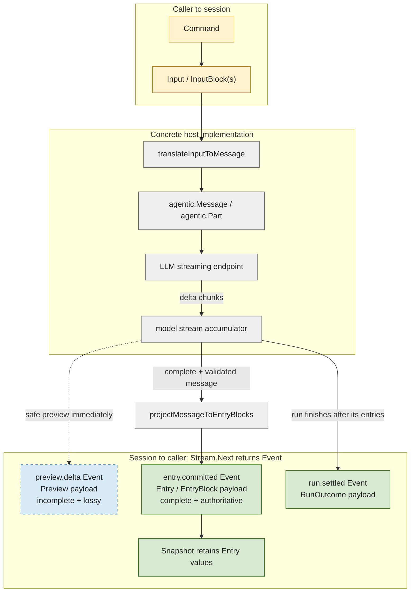

# Harness Session Loop: Provider-Neutral Protocol and Compatibility Plan

**Status:** implementation plan; no code described here exists yet

**Baseline:** `main` at `48d10d63ff31d1d1a8f3737b6f280e644bcd1539`
(`feat/harness-tui`) on 2026-08-05

**Primary release:** `github.com/regularkevvv/agentic/harness/sessionloop`
`v0.1.0`

**Compatibility rule:** the released Agentic Harness API, durable journal,
recovery behavior, event order, and TUI behavior do not change

## 1. Executive decision

Create `harness/sessionloop/` as an independent, standard-library-only nested Go
module. It defines the provider-neutral asynchronous session protocol shared by
Agentic Harness, the Agentic TUI bridge, and external consumers. It does not
execute a model, import Agentic, depend on a consuming application, or become a
second durable state machine beside Harness.

The protocol models a session as a long-lived actor:

1. a caller dispatches a typed command;
2. the session acknowledges acceptance independently of completion;
3. ordered events describe committed transcript entries and run lifecycle;
4. an authoritative snapshot reconciles missed events;
5. a run settles and the session becomes idle without destroying the session;
6. another command can begin a later run on the same session.

Agentic Harness remains the first implementation and the source of the proven
durability semantics. Its existing blocking methods remain supported with the
same behavior. Internally they are split into acceptance and execution only
after characterization tests freeze the current contract. The new asynchronous
view and the old blocking view then call the same private primitives:

```text
                           private, shared implementation
                                      │
                    ┌─────────────────┴─────────────────┐
                    │                                   │
        existing blocking API                 new sessionloop view
        Prompt / Resume / Interrupt            Dispatch / Events
                    │                                   │
                    └──────── existing journal ─────────┘
```

The first release is not complete merely because shared interfaces compile.
Completion requires all three of these uses:

- Agentic Harness exposes a conforming `sessionloop.Host` backed by its real
  durable sessions;
- the Agentic TUI can consume that host through a compatibility bridge without
  changing its public API or observable behavior; and
- a clean external consumer can use `sessionloop` without pulling root Agentic,
  Harness, TUI, provider SDKs, or terminal dependencies.

## 2. Why this belongs here

Latest `main` already has the two halves from which this boundary can be
extracted.

`harness/session` owns the mature execution semantics:

- single-flight states: idle, running, closing, suspended, interrupting,
  faulted, and closed;
- write-ahead `Steer`, `FollowUp`, and `NextTurn` queue acceptance;
- a durable `run.opened` and prompt before driver execution;
- ordered authoritative events plus best-effort previews;
- suspension/resume, interruption, recovery, usage accounting, and exclusive
  journal ownership; and
- explicit completed, interrupted, failed, and suspended execution outcomes.

`tui` now owns an initial presentation-neutral-looking `Host` and `Session`
port. That port validates the overall interaction shape, but it is intentionally
textual and blocking. It also includes terminal projection concepts and drops
the queue receipts returned by Harness. It therefore cannot become the shared
source of truth by moving files unchanged.

The reusable boundary belongs in the Agentic repository because Agentic Harness
has the strongest behavioral implementation and conformance fixtures. It must
be a separate module because source-level import neutrality is not enough:
`harness/go.mod` requires root Agentic. An ordinary `harness/sessionloop`
package would still place Agentic in every protocol-only consumer's module
graph.

## 3. Vocabulary

The terms in this plan are deliberately narrower than “agent loop.”

| Term | Meaning |
|---|---|
| **Host** | Creates or opens session handles. It does not choose a provider, model, tools, memory, permissions, or storage. |
| **Session** | A long-lived conversation and command receiver. It can contain zero or many runs over its lifetime. |
| **Run** | One active application-level exchange, including internal model/tool rounds and user steering. At most one is active per session. |
| **Command** | A caller request to start, steer, follow up, queue the next turn, resolve a suspension, or interrupt. |
| **Receipt** | Evidence that the host accepted a command. It is not the run result. |
| **Input** | One logical caller submission. Its ordered `InputBlock` values are parts of that submission, not separate turns. |
| **Event** | The one envelope returned by `Stream.Next`. Its kind selects the typed payload it carries. |
| **Entry** | One complete, authoritative conversation item. An `EventEntryCommitted` event carries it and a `Snapshot` retains it. |
| **Preview** | An incomplete, transient, lossy progress update carried by an `EventPreviewDelta` event. It never becomes conversation truth merely by being observed. |
| **RunOutcome** | The completed, interrupted, or failed settlement carried by an `EventRunSettled` event. It is not the assistant message. |
| **Position** | An opaque replay token plus a monotonic sequence in one session history. |
| **Settled** | A run reached completed, interrupted, or failed. Suspension is a durable pause, not settlement. |
| **Idle** | The session has no active or suspended run and may accept a new start. |

“Session loop” names the command/event coordination around a session. It does
not own the model/tool loop performed by an implementation.

## 4. Goals and non-goals

### Goals

1. Define one asynchronous interaction contract that does not import Agentic,
   Harness, TUI, a consuming application, a provider SDK, or a transport
   library.
2. Separate command acceptance from run completion.
3. Preserve the semantically distinct start, steer, follow-up, next-run,
   resolution, and interruption operations.
4. Make unsupported behavior discoverable through capabilities and explicit
   errors; never emulate it by silently changing user text.
5. Give consumers an authoritative event and snapshot model capable of
   representing multiple user messages inside one run.
6. Distinguish authoritative facts, replayability, and lossy previews.
7. Keep provider/model assembly and memory attachment application-owned.
8. Reuse the real Agentic Harness durability and recovery implementation rather
   than introduce a competing state store.
9. Keep every existing Agentic Harness and TUI public method source-compatible
   and behavior-compatible.
10. Provide conformance tests reusable by future Claude, Codex, Pi, OpenCode,
    or other host adapters.

### Non-goals

- A universal model, tool, permission, or provider API.
- A new persistence format for existing Agentic sessions.
- Moving `agentic.Message`, `agentic.Driver`, Agentic usage limits, capability
  DAGs, repair, context projection, or environment leases into the new module.
- Treating MCP, hooks, App Server, or any other transport as the abstraction.
- Making every harness support steering, durable replay, suspension, or
  idempotent dispatch. Optional behavior remains explicit.
- Defining or replacing application-specific principal attachment contracts.
  Session facade mode and attachment mode remain separate integration forms.
- Exposing chain-of-thought or raw secrets merely because a generic event type
  can carry structured content.
- Replacing the existing TUI public port in the first release.

## 5. Module and dependency architecture

### 5.1 Repository shape

```text
agentic/
  go.mod                                  root Agentic; unchanged dependency graph
  harness/
    go.mod                                requires Agentic + sessionloop
    session/                              existing durable implementation
    sessionloop/                          NEW NESTED MODULE
      go.mod                              sessionloop module; zero requirements
      README.md
      Makefile
      host.go
      command.go
      input.go
      entry.go
      event.go
      snapshot.go
      errors.go
      stream.go
      conformance/
      testkit/
  tui/
    go.mod                                requires released Harness + sessionloop
    adapter/sessionloop/                  projects protocol onto existing TUI port
```

The module path is:

```text
github.com/regularkevvv/agentic/harness/sessionloop
```

Its `go.mod` has no `require` or `replace` directives. Standard-library imports
such as `context`, `encoding/json`, `errors`, `io`, and `time` are allowed.

### 5.2 Import direction

```text
                  github.com/.../harness/sessionloop
                       no project dependencies
                         ▲       ▲       ▲
                         │       │       │
        Agentic Harness ─┘       │       └─ external consumer adapter
                                 │
                         Agentic TUI bridge
```

Forbidden arrows:

- `sessionloop -> agentic`
- `sessionloop -> harness`
- `sessionloop -> tui`
- `sessionloop -> consumer application modules`
- root Agentic `-> sessionloop`

The parent Harness module may depend on the deeper module. Root Agentic must
not: importing a nested module from the root would invert the repository's
published dependency rule.

### 5.3 Repository integration

Adding the module requires coordinated updates to:

- `ARCHITECTURE.md`: eight-module table, reason for the boundary, dependency
  and release order;
- `architecture_test.go`: documented module map, workspace membership, and a
  zero-require/no-replace invariant for `sessionloop`;
- `go.work`: include `./harness/sessionloop` because it is pure Go;
- root and module `Makefile`s: build, test, lint, vet, and independent 97%
  coverage;
- `.github/workflows/ci.yml`: dedicated module and lint jobs plus the workspace
  command;
- `.github/workflows/release-view.yml`: tag pattern, manual dispatch choice,
  `GOWORK=off` verification, and a clean no-replace consumer;
- `docs/README.md` and the module README; and
- release documentation and tag-order tests.

The root architecture test must fail if a future `require` is added to
`harness/sessionloop/go.mod` without an explicit architectural revision.

## 6. Protocol laws

These laws are normative. Adapters may provide stronger guarantees, never
weaker behavior under the same advertised capability.

### L1. One active run

A session has at most one running or suspended run. Starting while non-idle
fails explicitly. Queuing a next-turn input does not itself create a run.

### L2. Acceptance is not completion

`Dispatch` returns when the command is accepted according to the receipt's
guarantee. The answer and final outcome arrive through events and snapshots.
Waiting for settlement is a client convenience layered over the protocol.

### L3. Acknowledgement has a declared guarantee

A receipt reports one of:

- **accepted**: the owning host accepted the command, but crash replay is not
  promised; or
- **durable**: the command and required input facts are crash-durable and
  replayable before the receipt is returned.

Agentic Harness advertises and provides durable acceptance. A remote adapter
must not call an upstream acknowledgement durable unless it can actually replay
the accepted fact after its own failure boundary.

### L4. Context scope is precise

For the new API, the `Dispatch` context controls validation and acceptance only.
After a successful receipt, canceling that context does not cancel the run.
The run belongs to the session and is stopped through an interrupt command or
session close.

This is intentionally different from the new API's asynchronous nature, but it
must not alter legacy `Session.Prompt` and `Session.Resume`: their caller context
continues to govern the complete blocking operation exactly as today.

`Stream.Next` uses its context only for that wait. `Stream.Close` and
`Session.Close` are idempotent.

### L5. Authoritative data is not inferred from previews

Preview loss is allowed and observable. Transcript entries, command
acceptance, suspension, and run settlement require authoritative events or a
snapshot. A client never promotes accumulated deltas into a committed answer.

### L6. Replay positions are opaque

Consumers may compare positions for equality and use the numeric sequence for
monotonicity checks. They must pass the opaque token back unchanged and must
not parse it. A zero position means the event is not replayable.

### L7. Snapshot reconciles truth

`Snapshot` is a copy-owned authoritative view. When a stream reports lag, an
unknown position, or an event gap, the consumer discards speculative state,
loads a snapshot, and subscribes after its position.

### L8. Targeted commands cannot cross runs

Steer, follow-up, resolve, and interrupt carry the expected `RunID`. If the
active run changed, the command fails with `ErrStaleRun`; an implementation may
not apply it to the new run. `NextTurn` is session-targeted and is the exception.

### L9. Capabilities are honest

Capabilities are immutable for one opened session handle. Calling an
unsupported operation returns `ErrUnsupported`. An adapter must not simulate a
missing trusted-instruction seam, steering channel, or tool channel by
rewriting ordinary user content.

### L10. Settlement is singular

One run emits at most one authoritative settled outcome: completed,
interrupted, or failed. Suspension pauses the same run and resolution continues
the same run identity. The settled event follows every authoritative entry
belonging to that run.

### L11. Closing is not deletion

Closing releases the local handle and any writer lease. It does not erase a
durable session. Deletion, if ever added, is a separate optional host operation.

### L12. Content authority and privacy remain application-owned

The protocol can represent structured content, but an adapter exposes only the
detail authorized for that consumer. The existing TUI redaction boundary
remains in force. System instructions and hidden reasoning are omitted from the
default transcript projection.

## 7. Proposed `sessionloop` API

The exact spelling may receive normal implementation review, but implementation
must preserve the following shape and laws. A design change that collapses
`Dispatch` back into a blocking prompt call requires revising this plan first.

### 7.1 Host, session, and stream

```go
package sessionloop

type Host interface {
    NewSession(context.Context, SessionOptions) (Session, error)
    OpenSession(context.Context, SessionID) (Session, error)
}

type Session interface {
    ID() SessionID
    Capabilities() Capabilities
    Dispatch(context.Context, Command) (Receipt, error)
    Snapshot(context.Context) (Snapshot, error)
    Subscribe(context.Context, SubscribeOptions) (Stream, error)
    Close(context.Context) error
}

type Stream interface {
    Next(context.Context) (Event, error)
    Close() error
}
```

`OpenSession` means opening a handle to durable or remote session state. It is
not suspension resolution; `Resolve` is a command. An implementation with an
exclusive writer may return `ErrSessionOpen`.

`Next` is preferred over exposing Go channels in the minimum port. It maps
cleanly onto in-process channels, sockets, RPC streams, test fakes, and polling
transports while giving every wait an explicit context. `io.EOF` means the
stream closed normally.

Channel helpers may live in an optional `sessionloop/streamutil` package only
if a real consumer needs them; they are not required for `v0.1.0`.

### 7.2 Commands

```go
type CommandKind string

const (
    CommandStart     CommandKind = "start"
    CommandSteer     CommandKind = "steer"
    CommandFollowUp  CommandKind = "follow_up"
    CommandNextTurn  CommandKind = "next_turn"
    CommandResolve   CommandKind = "resolve"
    CommandInterrupt CommandKind = "interrupt"
)

type Command struct {
    ID             CommandID
    Kind           CommandKind
    RunID          RunID
    Input          *Input
    Resolution     *Resolution
    IdempotencyKey string
}
```

Validation is centralized and deterministic:

| Kind | `RunID` | `Input` | `Resolution` |
|---|---:|---:|---:|
| start | empty | required | empty |
| steer | required | required | empty |
| follow-up | required | required | empty |
| next-turn | empty | required | empty |
| resolve | required | optional continuation input | required |
| interrupt | required | empty | empty |

`CommandID` is always present in an accepted receipt and events caused by the
command. A host may generate it when omitted. `IdempotencyKey` is meaningful
only when `CapabilityIdempotentDispatch` is advertised. Without that capability
it must be rejected rather than accepted and ignored.

The three delivery commands remain distinct because they carry different
timing and recovery semantics:

- **steer** affects the active run at its next steerable boundary;
- **follow-up** continues the active run after its current candidate boundary;
- **next-turn** waits for a future start and survives interruption of the
  current run.

Implementations may support any subset. This is more honest than a universal
`Send` whose timing changes by provider.

### 7.3 Receipts

```go
type AcceptanceGuarantee string

const (
    AcceptanceAccepted AcceptanceGuarantee = "accepted"
    AcceptanceDurable  AcceptanceGuarantee = "durable"
)

type Receipt struct {
    CommandID CommandID
    SessionID SessionID
    RunID     RunID
    QueueID   QueueID
    Position  Position
    Guarantee AcceptanceGuarantee
}
```

For `start`, `resolve`, and `interrupt`, `RunID` identifies the affected run.
For queued input, `QueueID` identifies the durable queue item. A durable receipt
has a non-zero position at or after every fact required to reconstruct the
acceptance.

### 7.4 Capabilities

Capabilities are a set with standard constants, not a growing struct of booleans:

```go
type Capability string

const (
    CapabilityDurableAcceptance  Capability = "acceptance.durable"
    CapabilityReplay             Capability = "events.replay"
    CapabilityPreview            Capability = "events.preview"
    CapabilitySteer              Capability = "input.steer"
    CapabilityFollowUp           Capability = "input.follow_up"
    CapabilityNextTurn           Capability = "input.next_turn"
    CapabilityInterrupt          Capability = "run.interrupt"
    CapabilitySuspensionResolve  Capability = "run.suspension.resolve"
    CapabilityIdempotentDispatch Capability = "dispatch.idempotent"
    CapabilityDetailedTools      Capability = "content.tools.detailed"
    CapabilityStructuredOutput   Capability = "output.structured"
)
```

New, open, start, snapshot, authoritative committed entries, authoritative
settlement, and close are baseline protocol requirements and therefore are not
capabilities. A type that lacks them is not a `sessionloop.Host`.

Unknown capability strings survive round trips. `Capabilities.Supports` is the
only required query helper.

### 7.5 Input, previews, and committed entries

The protocol cannot be text-only: steering, tool activity, attachments, and
structured output must remain distinguishable. It also cannot use
`agentic.Message` as its public representation.

There is intentionally no generic public `Block` used in both directions.
`InputBlock` is caller-to-session intent. `EntryBlock` is
session-to-consumer, authoritative observation. Although they repeat a few
fields, separate types prevent input from accidentally carrying tool execution
facts and make every boundary visible at the call site.

An input is copy-owned content with optional application metadata:

```go
type Input struct {
    Blocks []InputBlock
    Meta   map[string]string
}

type InputBlockKind string

const (
    InputBlockText InputBlockKind = "text"
    InputBlockData InputBlockKind = "data"
)

type InputBlock struct {
    Kind      InputBlockKind
    Text      string
    MediaType string
    Data      json.RawMessage
}
```

One `Input` may contain many blocks. Those blocks are ordered parts of one
logical submission, such as text plus structured data; they are not multiple
user turns. Multiple turns are represented by multiple commands and later by
multiple committed entries. Metadata is for correlation, not instruction
smuggling. Implementations must not translate unknown metadata into
model-visible text. A concrete host may reject an otherwise valid structured
input with `ErrUnsupported` when it cannot translate that shape safely.

A committed entry uses its own outbound-only block vocabulary:

```go
type Role string

const (
    RoleUser      Role = "user"
    RoleAssistant Role = "assistant"
    RoleTool      Role = "tool"
)

type EntryOrigin string

const (
    OriginStart      EntryOrigin = "start"
    OriginSteer      EntryOrigin = "steer"
    OriginFollowUp   EntryOrigin = "follow_up"
    OriginNextTurn   EntryOrigin = "next_turn"
    OriginAssistant EntryOrigin = "assistant"
    OriginTool      EntryOrigin = "tool"
)

type Entry struct {
    ID        EntryID
    SessionID SessionID
    RunID     RunID
    CommandID CommandID
    Position  Position
    Role      Role
    Origin    EntryOrigin
    Blocks    []EntryBlock
}

type EntryBlockKind string

const (
    EntryBlockText       EntryBlockKind = "text"
    EntryBlockData       EntryBlockKind = "data"
    EntryBlockToolCall   EntryBlockKind = "tool_call"
    EntryBlockToolResult EntryBlockKind = "tool_result"
)

type EntryBlock struct {
    Kind       EntryBlockKind
    Text       string
    MediaType  string
    Data       json.RawMessage
    ToolCall   *EntryToolCall
    ToolResult *EntryToolResult
}
```

Entry tool calls and results have stable call IDs, names, error state, and
optional JSON data. An adapter validates that `Data` contains one complete JSON
value before exposing it. `json.RawMessage` is copied at every API boundary.

The default authoritative projection excludes system/developer instructions,
hidden reasoning, provider signatures, and provider-private metadata. A future
extension can add explicitly authorized content without weakening that default.

`Stream.Next` never returns an `Entry`, `Preview`, provider chunk, or model
message directly. It returns `Event`; the event kind selects one typed payload.
In particular, assistant text is in `Event.Entry.Blocks` when
`Kind == EventEntryCommitted`. `RunOutcome.Output` is reserved for optional
application-projected structured output and must not be used as another name
for assistant text.



This is production LLM streaming support at the correct abstraction boundary.
The host may consume provider-specific chunks and expose canonical previews
without waiting for a full block. It must wait for a complete, validated model
message before committing an authoritative entry. Preview support is optional
and lossy; entry and settlement semantics do not depend on receiving every
preview. In the Agentic implementation, `RuntimeConfig.ModelStreaming` selects
this path when the configured model implements `agentic.StreamModel`; the
real-host conformance fixture exercises `RequestStream`, not a simulated
post-hoc transcript split.

### 7.6 Position and events

```go
type Position struct {
    Sequence uint64
    Token    string
}

type EventNature string

const (
    EventAuthoritative EventNature = "authoritative"
    EventPreview       EventNature = "preview"
)

type EventKind string

const (
    EventCommandAccepted EventKind = "command.accepted"
    EventEntryCommitted  EventKind = "entry.committed"
    EventQueueAccepted   EventKind = "queue.accepted"
    EventQueueDrained    EventKind = "queue.drained"
    EventQueueCancelled  EventKind = "queue.cancelled"
    EventRunStarted      EventKind = "run.started"
    EventRunSuspended    EventKind = "run.suspended"
    EventRunSettled      EventKind = "run.settled"
    EventSessionState    EventKind = "session.state"
    EventUsage           EventKind = "usage"
    EventPreviewDelta    EventKind = "preview.delta"
)
```

The `Event` envelope contains common identity and exactly one relevant typed
payload:

```go
type Event struct {
    Position   Position
    Ordinal    uint64
    Nature     EventNature
    Kind       EventKind
    SessionID  SessionID
    RunID      RunID
    CommandID  CommandID
    State      State
    Entry      *Entry
    Queue      *QueuedInput
    Suspension *Suspension
    Outcome    *RunOutcome
    Usage      *Usage
    Preview    *Preview
    Dropped    uint64
}
```

Every authoritative event has a non-zero position when replay is advertised.
Preview events may repeat the latest durable position and use `Ordinal` for
arrival order. Unknown event kinds are allowed only as explicitly namespaced
extensions; the standard typed payload remains empty.

### 7.7 State, suspension, and outcome

The common state machine is:

```text
                         resolve
                       ┌──────────┐
                       │          ▼
idle ── start ──> running ──> suspended
 ▲                 │  │             │
 │                 │  └─ interrupt ─┤
 │                 │                │
 └── settled <─────┴────────────────┘

any open state ── internal invariant/storage failure ──> faulted
idle/faulted ── close ──> closed
```

`closing` and `interrupting` remain observable transitional states. A failed
run may settle back to idle; a session-level invariant or storage failure moves
the session to faulted. The adapter must not conflate the two.

```go
type RunOutcomeKind string

const (
    RunCompleted   RunOutcomeKind = "completed"
    RunInterrupted RunOutcomeKind = "interrupted"
    RunFailed      RunOutcomeKind = "failed"
)
```

`RunOutcome` can carry a sanitized failure and an optional structured output.
Structured output is absent unless the host advertises the capability and an
application-owned projector is configured. The generic layer never serializes
an arbitrary `O` by reflection without that explicit projector.

A suspension has an ID, kind, safe description, and typed decisions. Opaque
provider state stays in the concrete adapter. Resolution always targets both
the current run and exact suspension ID.

### 7.8 Snapshot

```go
type Snapshot struct {
    SessionID    SessionID
    Position     Position
    State        State
    ActiveRunID  RunID
    Entries      []Entry
    Pending      []QueuedInput
    Suspension   *Suspension
    Usage        Usage
    Capabilities Capabilities
}
```

Entries are in authoritative conversation order and retain run and command
attribution. A snapshot does not need to contain provider history hidden from
the application. Compaction may change the effective entry set, but the
snapshot position and explicit compaction event prevent clients from treating
the new projection as an append-only continuation of the old one.

### 7.9 Errors

The module defines portable sentinels and typed context:

- `ErrUnsupported`
- `ErrInvalidCommand`
- `ErrSessionBusy`
- `ErrSessionOpen`
- `ErrSessionClosed`
- `ErrSessionFaulted`
- `ErrStaleRun`
- `ErrSuspended`
- `ErrNotRunning`
- `ErrLagged`
- `ErrUnknownPosition`
- `ErrCommandConflict`

Adapters preserve concrete causes. Generic callers can use `errors.Is` against
the portable category; Agentic callers using the legacy methods continue to
see the existing Harness sentinels. Error strings are not the contract.

## 8. Agentic Harness implementation

### 8.1 Do not add a second state machine

The new module defines the protocol and conformance suite. The existing
`harness/session.Session` continues to own:

- locking and single-flight state;
- queue timing;
- journal append batches and cursor advancement;
- driver/tool execution;
- recovery and repair;
- suspension and resume planning;
- event publication; and
- fault transitions.

The sessionloop view delegates to those semantics. It does not maintain its own
authoritative transcript, queue, or session state.

### 8.2 Freeze behavior before refactoring

Before splitting a blocking operation, add deterministic characterization tests
covering the existing public surface. They record:

- returned execution status and `errors.Is` identities;
- state and snapshot immediately before and after every method;
- normalized journal entry kind, sequence, parent, durability, and decoded
  payload;
- public raw event and typed observation order;
- driver invocation count and the exact durable frontier visible immediately
  before `Driver.Drive`;
- context cancellation behavior before acceptance, during model execution,
  during tool execution, and during close; and
- reopen/recovery from committed fixtures created by `harness/v0.2.0`.

At minimum, fixtures cover:

1. successful tool-free prompt;
2. successful multi-tool exchange;
3. steer and follow-up timing;
4. next-turn survival across interruption;
5. suspension and resume with stable exchange instructions;
6. interruption while the model returns a late result;
7. process loss after `run.opened` and before `run.closed`;
8. preview loss and subscriber lag;
9. journal append conflict/fault; and
10. idempotent close and reopen ownership.

Existing persisted kind names and payloads remain unchanged. A new protocol
projection may expose more typed information, but it reads the current facts; it
does not rewrite them.

### 8.3 Split acceptance from execution privately

Refactor `Prompt` without changing its signature or observable ordering:

```text
Prompt(ctx, message)
    ├─ prepareStart(ctx, message)
    │    resolve instructions
    │    validate state/budget
    │    append existing run.opened + queued drains + prompt batch
    │    transition to running
    │    publish the existing authoritative records
    │    return an acceptedRun
    └─ driveAccepted(ctx, acceptedRun)
         invoke the existing Driver.Drive
         use the existing finishExecution path
```

The legacy method passes its caller context through both steps exactly as now.
The sessionloop view uses the caller context for `prepareStart`, then runs
`driveAccepted` under a session-owned context after returning the receipt.

Apply the same pattern to resume. Interruption is split into durable interrupt
request and settlement wait only if the current implementation cannot expose a
receipt without changing when `Interrupt` returns. The legacy method continues
to perform both pieces synchronously.

The private accepted-run value is single-use. Tests prove it cannot drive twice,
be resumed under another session, or outlive close.

### 8.4 Session-owned asynchronous lifecycle

The sessionloop view owns only goroutine lifecycle, not domain state:

- one session lifetime context;
- one active execution goroutine maximum;
- a wait group joined by `Close`;
- terminal errors projected into authoritative outcome/state events by the
  existing finish path; and
- no goroutine started before durable acceptance succeeds.

If dispatch is canceled before acceptance, no run may be left executing. If it
is canceled after the durable append but before the caller receives the
receipt, the implementation completes the acceptance handshake deterministically:
either return the receipt or synchronously request interruption and return the
documented cancellation error. A race must never create an unowned run.

### 8.5 Agentic-to-neutral projection

Add the projection beside `harness/session`, where the configured codec and
private journal schemas are available. It maps, but does not expose:

- `sessionloop.InputBlock` -> `translateInputToMessage` -> model-facing
  `agentic.Message` parts at the inbound boundary;
- provider streaming deltas -> safe `sessionloop.Preview` values while the
  message remains incomplete;
- complete committed `agentic.Message` -> `projectMessageToEntryBlocks` ->
  copy-owned `sessionloop.EntryBlock` values at the outbound boundary;
- `agentic.ToolUse` -> validated JSON tool-call data;
- `agentic.ToolResult` -> tool-result data and error state;
- Agentic execution status -> `RunOutcome`;
- Harness queue receipt -> protocol receipt;
- Harness state -> protocol state; and
- internal cursor `(Seq, EntryID)` -> protocol position.

The projection adds run identity and command/queue attribution that the current
TUI observation intentionally omits. It must use durable journal facts for
replay rather than reconstructing a completed run by guessing around “the last
user message.” This is necessary for steering and recovery correctness.

System/context messages are excluded from the default external transcript.
Application-visible system messages, if ever required, need an explicit
projection option; they are not enabled as a side effect of this work.

### 8.6 Agentic host constructor

The Harness module exposes an additive constructor returning the neutral port,
for example:

```go
host, err := harness.NewSessionLoopHost(runtime, options...)
```

`runtime` is the already application-assembled `*harness.Harness[O]`. The
constructor never creates a model, provider, store, permission policy,
capability, tool, memory system, or TUI.

An optional application-owned output projector can convert `O` into a
`sessionloop.Value`. Without one, typed application output stays on the legacy
Harness API and the loop exposes committed assistant/tool entries plus outcome.

`NewSession` and `OpenSession` call the existing Harness methods. Closing the
protocol session must close the root Harness wrapper, not only its embedded
internal session, so the in-process ownership registry is released exactly as
today.

### 8.7 Command mapping

| Sessionloop command | Existing Agentic semantic source |
|---|---|
| start | private acceptance half of `Session.Prompt` |
| steer | `Session.Steer`; preserve returned queue ID/cursor |
| follow-up | `Session.FollowUp`; preserve returned queue ID/cursor |
| next-turn | `Session.NextTurn`; preserve returned queue ID/cursor |
| resolve | private acceptance half of `Session.Resume` |
| interrupt | private request half of `Session.Interrupt` |

Agentic advertises durable acceptance, replay, previews, all three queue modes,
interrupt, and suspension resolution. It does not advertise idempotent dispatch
until idempotency keys are durably recorded and recovery-tested. That can be a
later additive release; an in-memory deduplication map is insufficient.

## 9. TUI compatibility strategy

The current `tui.Host`, `tui.Session`, DTOs, and constructors remain public and
unchanged in the first release. In particular:

- `Submit`, `Resolve`, and `Interrupt` may continue blocking in the operation
  worker until their current durable boundary;
- snapshots retain their current textual and presentation-safe projection;
- tool arguments/results do not begin crossing the terminal boundary;
- preview coalescing, lag recovery, and key behavior remain unchanged; and
- provider/model/capability assembly remains application-owned.

Add `tui/adapter/sessionloop`, which adapts a neutral host to the existing TUI
port:

1. `Submit` dispatches start and then waits for that exact `RunID` to suspend or
   settle, reproducing the current blocking operation-worker behavior.
2. Queue methods dispatch and return after acceptance, as the current TUI does.
3. `Resolve` and `Interrupt` wait to the same current boundaries.
4. Events and snapshots pass through the existing safe presentation projector.
5. A lagged stream triggers snapshot/re-subscription exactly as today.

Keep `tui/adapter/harness` as the supported constructor. It may delegate to the
new bridge only after differential tests run the direct and sessionloop-backed
adapters against the same scripted Harness and prove identical normalized TUI
snapshots, events, operation completion, and errors. If equivalence is not
proven in the initial release, ship the new bridge without switching the old
constructor; the Harness implementation still constitutes real Agentic use.

## 10. External consumption boundary

An external consumer is an acceptance proof, not a dependency or a package in
this repository.

The downstream import belongs in the consumer's dependency-bearing adapter
module, never in a dependency-neutral core:

```go
import "github.com/regularkevvv/agentic/harness/sessionloop"
```

The facade-mode runtime composes two independent contracts:

```text
application principal binding            sessionloop host
fresh trusted instructions + tools       commands + events + snapshots
                 │                                  │
                 └──────── concrete principal ──────┘
                                      │
                              application facade session
```

The shared protocol does not contain memory concepts. The consuming application
remains responsible for:

- atomically binding fresh instructions, tools, and completed-run observation;
- choosing whether it owns the top-level facade;
- folding ordered committed entries into memory;
- preventing double recording between facade and attachment modes; and
- evolving its current single-user/single-assistant completed-turn DTO before
  advertising lossless steering. Multiple user entries in one run must not be
  collapsed into “first user plus last assistant.”

The Agentic implementation is downstream-ready only when an independent
consumer can:

1. bind memory to an application-assembled Agentic Harness;
2. obtain a `sessionloop.Host` without importing TUI;
3. dispatch a prompt and receive a durable receipt before completion;
4. dispatch a steer while the run is active;
5. observe ordered authoritative entries and one settled outcome;
6. see the session return to idle and start another run; and
7. close/reopen without double-recording the completed run.

Application-specific proof belongs in the consumer's own tests after the
Agentic releases. Agentic carries a dependency-free conformance consumer so the
protocol cannot regress between releases.

## 11. Implementation sequence

Each phase is independently reviewable. Do not combine the module contract and
the internal session refactor into one unreviewable change.

### S0 — Baseline and behavioral lock

Changes:

- add this plan to the documentation index;
- add deterministic legacy trace fixtures and `harness/v0.2.0` recovery
  fixtures;
- add missing race/cancellation tests around prompt, resume, interrupt, close,
  queue timing, observation replay, and instruction resolution; and
- document the exact existing behavior that the later phases must preserve.

Exit gate:

- no production behavior change;
- current Harness/TUI/full-workspace gates green;
- fixtures fail under intentional ordering, payload, state, and cancellation
  mutations.

### S1 — Independent protocol module

Changes:

- create `harness/sessionloop/go.mod`, types, validation, cloning, errors,
  stream contract, testkit, and conformance suite;
- add module README with the command/event mental model and a fake-host example;
- integrate the eighth module into architecture, workspace, Makefiles, CI,
  coverage, lint, and release-view checks; and
- add a clean module-graph test proving no project or third-party dependency.

Exit gate:

- `go list -m all` from the module lists only itself;
- `GOWORK=off go test -race ./...`, vet, pure-Go build, lint, tidy-diff, and 97%
  coverage pass inside the module;
- a clean consumer imports only `sessionloop` and exercises the test host; and
- existing Agentic/Harness/TUI code is untouched except repository integration.

### S2 — Additive Agentic protocol projection

Changes:

- map existing durable journal and event facts to neutral positions, entries,
  queue facts, suspensions, outcomes, and snapshots;
- add run identity to the projection without changing old raw/typed event
  structures unless fields are purely additive;
- add replay tests from every durable entry kind and malformed-payload tests;
  and
- add privacy tests proving system instructions, raw hidden reasoning, and
  unconfigured structured output do not leak.

Exit gate:

- every current journal kind either maps deliberately or is documented as an
  ignored internal fact;
- snapshot and replay reach the same normalized state;
- multi-user steering retains entry order and run attribution; and
- all S0 legacy traces remain byte/sequence equivalent.

### S3 — Shared acceptance/execution primitives

Changes:

- privately split prompt and resume acceptance from drive;
- split interrupt request from settlement wait if required;
- keep legacy methods as synchronous composition over the new primitives;
- add session-owned async lifecycle management; and
- add cancellation and goroutine-leak stress tests.

Exit gate:

- legacy characterization fixtures remain unchanged;
- no driver call occurs before the existing durable append frontier;
- each accepted run drives exactly once;
- canceled pre-acceptance dispatch leaves no run;
- accepted runs survive dispatch-context cancellation; and
- `go test -race -count=100` passes for the focused dispatch/interrupt/close
  race suite.

### S4 — Agentic `sessionloop.Host`

Changes:

- add the application-assembled host constructor;
- implement new/open, dispatch, snapshot, stream, capabilities, and close;
- run the independent conformance suite against the real in-memory Harness;
- add JSONL recovery and reopened-host conformance; and
- add a credential-free example with a scripted driver.

Exit gate:

- Agentic passes every baseline and advertised optional conformance case;
- durable receipts precede driver execution;
- stream settlement and snapshot state agree;
- close releases the existing Harness ownership registry; and
- legacy callers can ignore the new module with no API or behavior change.

### S5 — TUI bridge and differential proof

Changes:

- implement `tui/adapter/sessionloop`;
- add safe projection and blocking convenience waits;
- run direct-Harness and sessionloop-backed adapters against identical scripts;
  and
- delegate the old Harness adapter only if equivalence is complete.

Exit gate:

- no TUI public API change;
- no raw tool payload or hidden instruction leak;
- normalized snapshots/events and operation boundaries match;
- all existing TUI golden snapshots remain unchanged; and
- offline terminal example behavior is unchanged.

### S6 — Release and external-consumer proof

Release in dependency order:

1. `harness/sessionloop/v0.1.0`;
2. update Harness to the published dependency and release the next Harness
   minor version;
3. update TUI to published Harness/sessionloop versions and release its next
   minor version if its module changed; and
4. verify a fresh external consumer and let downstream adapters update in their
   own repositories.

Every release uses `GOWORK=off`, contains no `replace`, and is verified from a
fresh module/cache. A workspace-only green build is not release proof.

### S7 — Optional internal consolidation

Only after the released protocol, TUI bridge, and external-consumer proof are stable,
consider making additional Harness internals use generic reducers or helpers.
This phase is optional. Do not move the durable journal or Agentic execution
model merely to maximize shared code.

## 12. Test and proof matrix

### 12.1 Protocol-module conformance

The reusable conformance suite is table-driven by advertised capabilities.
Baseline cases:

- new/open/close lifecycle;
- start receipt and exact run identity;
- authoritative entry order;
- one settlement per run;
- idle after settlement and a second run;
- snapshot copy ownership;
- stream close and canceled `Next`;
- invalid command matrix;
- stale targeted command rejection;
- concurrent start single-flight; and
- no events after closed except stream termination.

Optional cases activate only when advertised:

- durable position and replay;
- preview loss/gap reporting;
- steer, follow-up, and next-turn timing;
- interrupt;
- suspension and exact resolution;
- detailed tool content;
- structured output; and
- durable idempotency.

The suite must test claims, not implementation types. It receives a host factory
and black-box control hooks only for deterministic scheduling.

### 12.2 Agentic compatibility

For every S0 scenario, compare before/after:

| Surface | Equality requirement |
|---|---|
| Legacy API | signatures, return status, typed output, and `errors.Is` |
| State | same transitions and method-visible boundaries |
| Journal | same kind order, durability, decoded payload, and recovery result |
| Driver | same inputs, options, call count, and cancellation |
| Instructions | resolved once per new exchange; stable through resume |
| Queue | same acceptance/drain/cancel timing and cursor |
| Events | same authoritative order; same preview loss rules |
| TUI | same public DTOs, snapshots, rendered goldens, and worker completion |
| Ownership | same close/open exclusivity and idempotency |

New sessionloop events may add a parallel projection. They may not reorder or
mutate the existing streams.

### 12.3 Concurrency schedule

Focused race tests coordinate exact barriers for:

- two simultaneous starts;
- start versus next-turn acceptance;
- steer at candidate commit and closing boundaries;
- interrupt versus late assistant/tool result;
- resolve versus close;
- dispatch cancellation immediately before and after durable append;
- stream lag while authoritative facts continue;
- close while `Stream.Next` waits;
- close while async drive is active; and
- reopen after faulted owner replacement.

Use barriers/channels, not sleeps. Stress each focused scenario with
`-race -count=100`; ordinary CI may use a smaller count if runtime requires it,
but the PR evidence records the full stress command.

### 12.4 Module and consumer gates

Required implementation-time commands include:

```text
cd harness/sessionloop
GOWORK=off go test -race -count=1 ./...
GOWORK=off go vet ./...
GOWORK=off CGO_ENABLED=0 go build ./...
GOWORK=off go mod tidy -diff
make coverage-check

cd ../
GOWORK=off go test -race -count=1 -timeout 60s ./...
GOWORK=off go vet ./...
GOWORK=off CGO_ENABLED=0 go build ./...
GOWORK=off go mod tidy -diff
make coverage-check

cd ../tui
GOWORK=off go test -race -count=1 -timeout 60s ./...
GOWORK=off go vet ./...
GOWORK=off CGO_ENABLED=0 go build ./...
GOWORK=off go mod tidy -diff
make coverage-check

cd ..
make test
make vet
make build
make coverage-all
```

Run repository lint through the pinned Make targets/CI action. Do not use an
unversioned locally installed linter as release evidence.

The fresh consumer verifies both compilation and the negative dependency
promise. Its module graph must not contain:

- `github.com/regularkevvv/agentic`
- `github.com/regularkevvv/agentic/harness`
- Bubble Tea/Lip Gloss
- OpenAI/Anthropic SDKs
- GoMonty or native runtime loaders

The parent Harness consumer will contain root Agentic by design.

## 13. Security and authority invariants

1. Sessionloop never reads environment variables, credentials, provider config,
   or global settings.
2. The host constructor receives an already assembled Harness; it does not
   silently choose models, tools, permissions, memory, or code execution.
3. Unknown metadata is not rendered into prompts.
4. System/developer instructions are not part of the default transcript/event
   projection.
5. Hidden reasoning and provider signatures are not authoritative content.
6. Detailed tool inputs/results require the host's explicit projection and
   capability; the TUI bridge remains safely redacted.
7. Preview deltas never become committed transcript truth.
8. A target run ID is validated before steering, resolving, or interrupting.
9. Resolution validates the exact current suspension and complete required
   decision set before resume.
10. Closing releases resources; deleting durable data requires a future
    separate, explicit operation.

## 14. Risks and mitigations

### Two sources of truth

**Risk:** an async wrapper duplicates state already owned by Harness.

**Mitigation:** sessionloop view owns only command dispatch and goroutine
lifecycle. Snapshot, queues, state, cursor, and settlement come from the
existing session/journal.

### Accidental behavior change during `Prompt` split

**Risk:** lock timing, context ownership, event order, or instruction resolution
moves.

**Mitigation:** S0 characterization precedes production refactoring; legacy
methods compose the exact same acceptance/drive primitives; differential
fixtures and race barriers are merge gates.

### False durability claims

**Risk:** a remote acknowledgement or in-memory queue is labeled durable.

**Mitigation:** receipt guarantee and replay capability are separate and tested.
Only recoverable facts may use `AcceptanceDurable`.

### Lowest-common-denominator API

**Risk:** one vague `Send` erases steer/follow-up/next-run differences.

**Mitigation:** explicit command kinds plus capability negotiation and
`ErrUnsupported`.

### Presentation data leaks

**Risk:** moving the TUI port downward exposes raw tools or instructions.

**Mitigation:** sessionloop is a trusted protocol DTO, while the TUI bridge
retains a separate safe projection. No direct type alias from protocol entries
to TUI entries.

### Unused abstraction

**Risk:** types ship but the real Harness and consumers continue using unrelated
wrappers.

**Mitigation:** S4 real Harness conformance and S6 fresh-consumer acceptance are
part of the delivery definition, not optional examples.

### Module-release deadlock

**Risk:** Harness requires an unpublished sessionloop version or local replace.

**Mitigation:** release sessionloop first, then update Harness to the published
tag, then TUI. Downstream consumers update independently. Release-view tests
run with `GOWORK=off`.

### Generic protocol becomes a universal harness

**Risk:** model/tool/capability policy migrates downward and couples every
consumer.

**Mitigation:** enforce the forbidden import graph and the non-goals. The module
owns interaction semantics only.

## 15. Resolved design decisions

| Question | Decision |
|---|---|
| Ordinary package or nested module? | Nested module, so neutrality holds in the module graph. |
| Protocol or second engine? | Protocol plus conformance; existing Harness remains the engine. |
| Blocking `Prompt` or async dispatch? | Async dispatch with receipt; blocking waits are adapters. |
| One `Send` method? | No. Preserve explicit delivery semantics as command kinds. |
| Go channels in minimum API? | No. Context-aware `Stream.Next`; channel bridges are optional. |
| Numeric or opaque cursor? | Both monotonic sequence and opaque token in `Position`. |
| Is suspension settlement? | No. It is a durable pause of the same run. |
| Does dispatch context own the run? | Only until acceptance in the new API; legacy contexts remain unchanged. |
| Is idempotency required in v0.1? | No. It is an advertised capability only after durable proof. |
| Does TUI move its DTOs into sessionloop? | No. It keeps a separate safe presentation projection. |
| Does this define application attachment contracts? | No. It defines session facade interaction; attachment remains application-owned. |
| Can the host choose providers/capabilities? | No. It wraps an application-assembled Harness. |
| Can existing journal payloads change? | No. Projection is additive and reads existing facts. |
| Why separate input and entry block types? | They cross opposite authority boundaries. The small field repetition prevents caller input from masquerading as observed tool execution. |
| Does LLM streaming require a complete entry first? | No for lossy `Preview` events; yes before the complete message becomes an authoritative `Entry`. `Stream.Next` returns `Event` in both cases. |

## 16. Definition of done

This work is complete only when all statements below are true:

- [ ] `harness/sessionloop` is an independently released zero-require module.
- [ ] Its public contract models async acceptance, ordered events, snapshots,
      suspension, settlement, idle reuse, and honest capabilities.
- [ ] Root Agentic does not import it.
- [ ] Agentic Harness exposes a real conforming host over application-assembled
      durable sessions.
- [ ] Existing `Prompt`, `Resume`, `Interrupt`, queue, snapshot, observation,
      close, recovery, and error behavior pass frozen compatibility fixtures.
- [ ] Existing session journals reopen without migration or payload rewrite.
- [ ] Agentic durable receipts are committed before driver execution.
- [ ] Targeted commands cannot leak into a later run.
- [ ] Preview loss cannot corrupt authoritative transcript state.
- [ ] Public types and Mermaid documentation make `InputBlock`, `Preview`,
      `EntryBlock`, `Event`, and `RunOutcome` visibly distinct, including the
      provider-streaming timeline.
- [ ] TUI can consume the protocol through a safe bridge without public API,
      rendering, redaction, or operation-boundary regressions.
- [ ] Module, Harness, TUI, workspace, race, vet, build, lint, tidy-diff, and
      independent coverage gates pass.
- [ ] Release-view jobs prove published dependency order with no replacements.
- [ ] A fresh sessionloop-only consumer has no Agentic/Harness/TUI/provider
      dependencies.
- [ ] A fresh external consumer uses the published protocol to run a prompt,
      steer the active run, observe one authoritative settlement, return to
      idle, start a second run, and close/reopen without duplication.
- [ ] Documentation clearly distinguishes session facade mode, principal
      attachment mode, and the existing Agentic blocking API.

Until the fresh-consumer acceptance item is green, the implementation may be
useful but its published dependency boundary is not yet release-proven.
