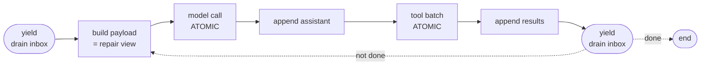
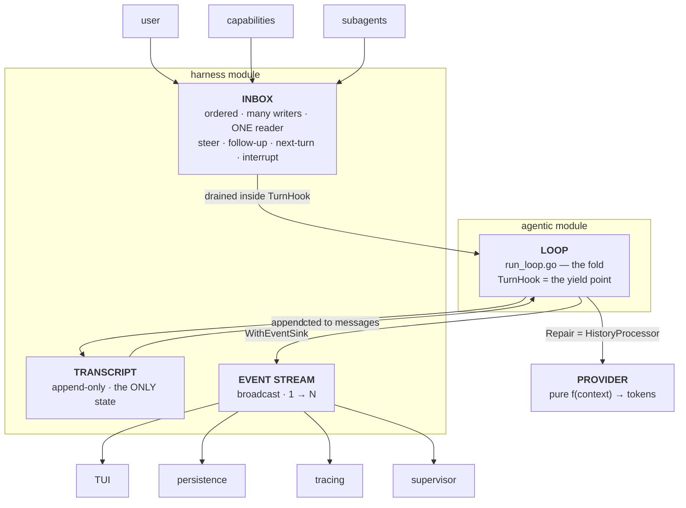
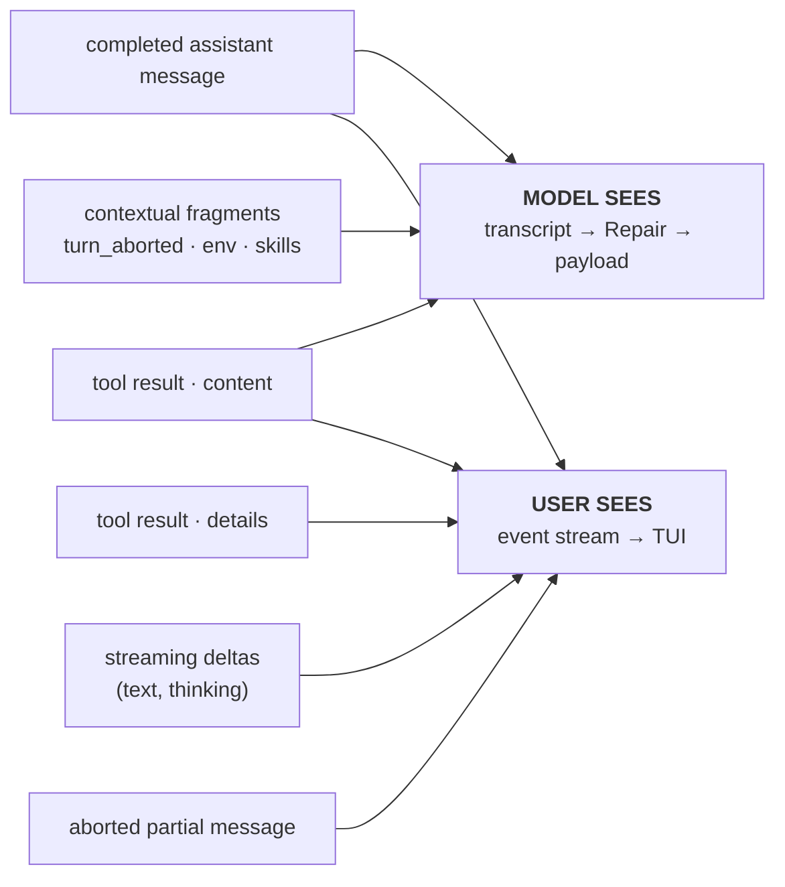
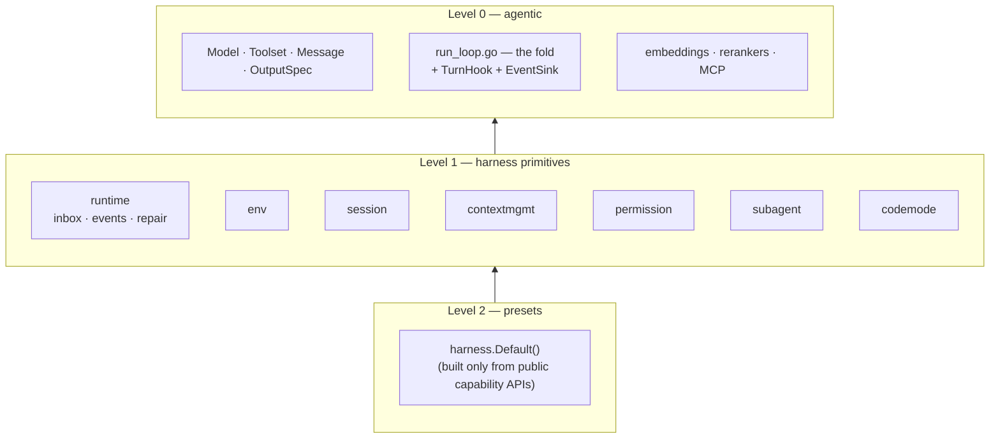

# Spike: Harness Framework, Monorepo Layout, and Embeddings/Rerankers Expansion

**Status:** Proposed (spike deliverable)
**Date:** 2026-07-19
**Scope:** Research result + implementation plan. No code changes were made as part of this spike.

---

## 1. Summary

This spike answers three questions:

1. **How do we restructure `agentic` into a monorepo** that contains `agentic` as a module plus a new `harness` module?
2. **How should the harness framework be designed** so people can use a harness we ship *or* build their own from primitives?
3. **What do we add to `agentic` proper** in embedding providers and rerankers?

The recommendations:

**Monorepo.** Keep `github.com/regularkevvv/agentic` at the repo root — moving it breaks the published import path and the two existing tags — and add a *nested* module at `harness/` (`github.com/regularkevvv/agentic/harness`), tied together with `go.work` for development. The harness builds only on the public `agentic.*` facade; `aliases.go` was effectively designed for this.

**Harness design.** Part I of this document derives the design from first principles rather than from a feature list, because the research made clear that the tool loop is commodity and everything interesting is the machinery around it. The core claims: a harness answers seven separable questions; *substrates* want swappable interfaces while *policies* want composable hooks, and conflating them is the most common design error in the references; an agent instance is a closure over a captured environment, which makes multi-agent a capture-restriction problem rather than a subsystem; and the runtime is a **cooperative scheduler over an append-only log with a broadcast output** — five nouns, two yield points, four verbs.

**Embeddings/rerankers.** Add Gemini, Ollama, Cohere, and Bedrock embedders (that effort order — the first two SDKs are already dependencies), and introduce a new `core.Reranker` interface with Voyage rerank-2.5 and Cohere Rerank as first implementations. Independent of the harness; ships as `agentic` v0.3.0.

---

## 2. Goals and non-goals

**Goals**

- A `harness` module where users can (a) instantiate a default harness and get sessions, compaction, permissions, subagents, and events out of the box; (b) assemble their own from the same primitives; (c) write third-party capabilities that plug into either.
- Preserve `agentic`'s public API and its positioning as a lightweight, type-safe agent library. Nothing in the harness may force new dependencies or complexity onto `agentic` users.
- Broaden retrieval in `agentic` itself (more embedders, new reranker capability).
- Keep a path open to codemode via monty/gomonty.

**Non-goals (for now)**

- A TUI or CLI product. The harness is a library; a product is a possible later consumer.
- Distributed/durable execution. We note the pattern (§16) and design so it can be added as a wrapper, but do not build it.
- A vector store. Like pydantic-ai, we ship embeddings + rerankers and leave storage to the user.

---

# Part I — Foundations

Everything in Part III derives from this part. If a later decision seems arbitrary, the justification is here.

## 3. What a harness is

A model is a pure function from context to tokens. An agent is a process that pursues a goal by acting over time. **The harness is everything that closes that gap** — it decides what enters context, what the tokens are permitted to mean, what they can affect, when to stop, and what survives. The model proposes; the harness disposes.

That framing makes the decomposition fall out as *questions*, not features. A harness answers seven:

| # | Question | The concern |
|---|---|---|
| 1 | What can it affect? | **Space of action** — filesystem, shell, network, browser, other agents |
| 2 | How does intent become effect? | **Mode of action** — direct tool calls, code-mode program, plan-then-execute, delegation |
| 3 | What surface is exposed? | **Interface of action** — tools, plus per-agent filtering/renaming/gating |
| 4 | What does it know? | **Knowledge** — history, compaction, cross-session memory, retrieval |
| 5 | When does it stop, and who steers? | **Control** — the loop, turns, budgets, termination, steering, interrupts |
| 6 | What is it allowed to do? | **Governance** — permissions, approval, sandboxing |
| 7 | How many, arranged how? | **Topology** — single agent, subagents, orchestrated fleets |

Plus two that are invisible until you build them and then are everywhere:

**Resources and progressive disclosure.** A "skill" in pi is *markdown, not code*: the system prompt carries only name, description, and path; the model reads the body on demand with the `read` tool. Codex's deferred MCP schema loading is the same idea. This is a third category alongside tools and environment — instructions the agent can *acquire*, not just instructions it *was given*.

**Output discipline.** The agent's perception is bounded, and bounding it is policy. pi has head/tail truncation with temp-file spill; pydantic-ai-harness has size bands with a pluggable `OverflowStore`. Both keep the full output reachable and hand the model a handle.

And one cross-cutting constraint that dictates *where* mutable state may live: **prompt-cache geometry.** pydantic-ai's `Planning` capability exists mostly to solve this — the plan is injected as an ephemeral tail after a `CachePoint`, mutating only the per-request message list so the cached prefix stays byte-identical. claw-code uses a `__SYSTEM_PROMPT_DYNAMIC_BOUNDARY__` marker for the same reason and reports ~84% savings on long Opus sessions. Anything mutable injected into context has a cache cost, so the harness needs one designated ephemeral region and everything else must be stable.

## 4. Two abstraction shapes

The single most useful rule this spike produced:

> **Substrates want interfaces. Policies want hooks.**

A *substrate* is something the same behavior can land on differently — a filesystem that might be local, overlaid, containerized, or remote. A *policy* is a decision layered over whatever substrate is present — compaction strategy, permission ruleset, guardrails, planning.

The references prove the rule by violating it. pydantic-ai-harness reaches for a `@runtime_checkable Protocol` with multiple backends everywhere it wants substitutability — `MemoryStore`, `StepStore`, `OverflowStore`, `MediaStore`, four of them, with in-memory/file/SQLite/Postgres implementations. But its `FileSystem` and `Shell` capabilities got *neither* a protocol nor an alternate implementation: eight hand-written tools calling `pathlib` and `os` directly, with glob allow/deny/protect patterns as the only knob. The result is that **the only substitutable filesystem in the whole library is Monty's `mount=` parameter, which lives inside a mode-of-action capability.**

pi fails the same axis from the other side. It *defines* the interface — `ExecutionEnv = FileSystem & Shell`, ~16 methods, `Result<T,E>` returns, closed error-code enums, never throws — but never threads it into tool execution. `AgentTool.execute()` has no env parameter and `AgentHarness` touches `env` in 3 of 1029 lines. So tools close over their own environment at construction, which is why its one real sandbox consumer (the Gondolin micro-VM extension) has to rebuild each tool per call with swapped operations, and still escape-hatched out of `GrepOperations` because ripgrep doesn't fit a two-method interface.

**Our rule: one environment interface, threaded through tool execution.** Details in §13.3.

A corollary that also comes from the references: **governance is orthogonal to environment, and neither substitutes for the other.** The environment defines what is *possible*; governance defines what is *permitted*. pydantic-ai-harness's shell capability matches only the first token of a command against a denylist and its own source concedes the checks "are not a security boundary — a sufficiently motivated agent can bypass them." `foo && rm -rf /` walks straight through. If you want a boundary you change the substrate (container, VM, monty's zero-capability default), not the pattern list.

## 5. Agents as closures

An agent instance is a closure: a policy (model + instructions) over a **captured environment** (deps, execution env, toolset, permissions, history, budget). `agentic` already has the constructor — `Bind(deps) → Runner`.

The payoff is at delegation, where "what does the child capture from the parent?" turns out to be *the* design question of multi-agent — and every system answers it field by field:

| | history | deps | budget/usage | tools | env |
|---|---|---|---|---|---|
| **pydantic-ai `SubAgents`** | isolate | share | share (default) | not inherited unless asked | share |
| **OpenHands delegation** | isolate (own `start_id`) | share | **share** (iteration + budget + metrics) | per-agent-class | share |
| **codex threads** | isolate | isolate | isolate | isolate (own registry) | isolate |

Those aren't three architectures; they're three **capture lists**. Modelling delegation as explicit per-field capture semantics (`share | isolate | narrow`) expresses all three with one primitive, and "multi-agent" stops being a subsystem and becomes closure creation with a restricted capture.

The framing also predicts a real bug. OpenHands' parent forwards *all* events to an active delegate indiscriminately, so a user's steering message meant for the parent silently re-steers the sub-agent — and burns the parent's shared budget doing it. That is a capture-scope error, and naming captures explicitly is what makes it visible.

## 6. The runtime model

### 6.1 Derivation

Three primitives, in order:

1. **The model call is a pure function.** `f(context) → tokens`, stateless, synchronous, one-shot. Every model call in every harness studied is strictly request/response. The non-linearity does not come from the model.
2. **The transcript is the only state.** Strategy, plan, progress, memory — if it isn't in the message list, it doesn't exist. This is why re-steering is cheap: there is no plan object to invalidate, only a context to change.
3. **The loop is a fold over the transcript**, repeated until a termination predicate holds.

The single source of non-linearity is that **the user produces input on wall-clock time and the loop consumes it on its own time.** Two independent timelines, one shared log.

That yields the termination predicate, which is *not* "the model stopped":

```
stop when:  model produced no tool calls  AND  inbox is empty
```

codex computes exactly this (`needs_follow_up = model_needs_follow_up || has_pending_input`); pydantic-ai converts an `End` node back into a `ModelRequestNode` when a pending message drains. The run ends when the model is done *and nobody has anything more to say*.

### 6.2 Cooperative scheduling

The turn is a **critical section**; turn boundaries are **yield points**; the inbox is polled only at yields.



Everything empirical falls out of this:

- **Steering is cheap** — it happens at a yield point where invariants hold. Nothing to repair.
- **Interruption is expensive** — it is *preemption*, breaking the critical section, so `tool_use` blocks are orphaned and cleanup is owed.
- **Nobody preempts mid-request.** Verified across all five references; codex has a regression test named `user_input_does_not_preempt_after_reasoning_item`. The one exception in the corpus: codex lets *inter-agent* mailbox mail break a stream mid-flight after a reasoning item. Agent-to-agent messages preempt; human ones don't — correct, since another agent's message is usually a blocking dependency while a human's is a course correction that loses nothing by waiting one turn.

This is textbook cooperative multitasking. Interrupt is the one preemptive operation, and like every preemptive operation in a cooperative system it needs an unwind handler (§8).

### 6.3 The five nouns



**The input/output asymmetry is the part that is not one pattern.** The inbox is an actor mailbox — many writers, exactly one reader, consumed at the reader's pace. The event stream is genuine pub/sub — one producer, N independent consumers, none able to influence the run. Conflating them is what makes this architecture feel murky in discussion.

Two properties fall out of the structure rather than being designed in: the run is **single-flight** (one fold at a time per session; concurrency lives in the inbox, not the loop), and the whole thing is **resumable** (state is a fold over an append-only log, so crash-recovery, fork, and branch are the same operation as normal execution).

## 7. The four verbs

Injection kinds differ *only* in which yield point drains them and whether they preempt. This is the API the whole steering story reduces to:

| Verb | Drains at | Preempts? | Repair needed? | Survives Interrupt? |
|---|---|---|---|---|
| **Steer** | next yield point (turn boundary) | no | no | no — cleared |
| **FollowUp** | after the run *would* have ended, re-opening it | no | no | no — cleared |
| **NextTurn** | prepended to the next run, before the user's prompt | n/a | no | **yes** |
| **Interrupt** | immediately; jumps the queue | **yes** | **yes** | n/a |

Notes that matter:

- **Steer ≠ Interrupt, and defaulting to Steer is the point.** Codex states it directly: interrupt is a last resort, not the primary mid-turn channel. Steering keeps full context and simply adds instructions; interrupting tears down and pays for repair.
- **NextTurn is not user steering.** It's the channel for capability-injected ambient context, which is why it must survive `Interrupt` (pi asserts exactly this in a test).
- **Drain mode defaults to one-at-a-time**, per pi. With `all`, two queued instructions arrive as adjacent user messages and the model tends to interleave or drop one; one-at-a-time guarantees the first is acted on, its tools run, and only then does the second enter.
- **Only steerable turn kinds accept a steer.** codex rejects steering a Review or Compact turn with a typed error the UI catches and requeues. Our runtime needs the same typed rejection rather than silently queueing into a turn that will never drain.
- **Undrained messages are an error, not a silent drop.** pydantic-ai raises `UndrainedPendingMessagesError` when a run reaches `End` with a non-empty queue. Copy this.
- **Steering resets loop-detection windows.** OpenHands' stuck detector only examines events after the last user message. That is right: you manually broke the trajectory, so prior repetition shouldn't count.

## 8. The repair contract

Preemption breaks the protocol invariant that every `tool_use` has a matching `tool_result`. Four independent implementations converged on the same answer, which makes this the strongest empirical finding in the spike:

> **Durable history is append-only truth. The provider payload is a derived, repaired view. Never mutate history to satisfy the API.**

- **codex**: `for_prompt` consumes history *by value*, so normalization runs on a clone.
- **pydantic-ai**: `_repair_dangling_tool_calls` is documented as deterministic and idempotent — synthesized returns derive timestamps from the response they repair and contain no wall-clock or random data, *specifically so repair never churns provider prompt-cache prefixes*.
- **pi**: repair lives in `transformMessages` at the provider boundary; aborted assistant messages stay in the session and JSONL but are excluded from every outbound request.
- **opencode**: repairs at write time and again at model-conversion time, with a comment naming the Anthropic constraint directly.

**`agentic` already implements this seam.** `buildRequest` passes the message list through the configured `HistoryProcessor` on every iteration, and the interface contract states it exactly: *"The processor affects only what's sent to the model — the agent's internal message list remains complete."* Repair is therefore a `HistoryProcessor`, not new machinery — and it composes with compaction through the existing `ChainProcessors`.

Our contract:

```go
// Repair projects durable history into a protocol-valid provider payload.
// It implements agentic.HistoryProcessor, so it plugs into the existing
// per-request projection seam and chains with compaction via ChainProcessors.
//
// Deterministic and idempotent: synthesized parts derive their identity from
// what they repair and contain no wall-clock or random data, so repeated calls
// are byte-identical and never churn provider prompt-cache prefixes.
// Never mutates the transcript.
func Repair(opts RepairOptions) agentic.HistoryProcessor

type RepairOptions struct {
    // RepairFrontier synthesizes results for open tool calls in the final
    // assistant message. Leave false when a deferred/HITL resume is pending —
    // those open calls are exactly what the resume will answer.
    RepairFrontier bool
}
```

Repair does four things: synthesize missing tool results for orphaned calls; drop orphaned results whose call is gone; exclude assistant messages marked aborted/errored; and preserve thinking blocks unchanged (never strip them — removal can trigger ordering/signature 400s).

Two refinements worth keeping:

- **Severity distinction** (codex): a missing function-call output is expected after an interrupt and logs at info; a missing custom-tool or local-shell output indicates a real bug and should be loud.
- **One function, every path.** Compaction must not orphan pairs; interruption must not; crash-resume must not; steering-after-a-partial-batch must not. All of them funnel through the same projection at the wire boundary.

## 9. Events: three destinations

The naive assumption is that what the model produces, the user sees, and the transcript stores are the same content. In every mature implementation they are three streams, and the divergence is deliberate **in both directions**:

- **User sees what the model won't.** codex streams message and reasoning deltas as UI-only events; history is recorded solely on `OutputItemDone`, so an assistant message cut off mid-stream is rendered and then discarded from history.
- **Model sees what the user won't.** codex's `<turn_aborted>` marker is a `user`-role message registered in `CONTEXTUAL_USER_FRAGMENTS` — invisible in the event stream, present in the payload. Same mechanism carries `<environment_context>`, `<user_shell_command>`, `<subagent_notification>`, AGENTS.md, and skills.
- **Tool results split.** pi's `AgentToolResult.content` goes to the model; `details` is "structured, for UI/logs" and never does. That is how a bash tool renders a rich progress pane while sending the model 200 tokens.



The overlap is smaller than intuition suggests, and the divergence runs in **both** directions — that is the point of the diagram, and the reason the event stream must never be implemented as a mirror of the transcript.

### 9.1 Taxonomy

| Loop step | Event | → transcript? |
|---|---|---|
| drain inbox | `UserMessage` | yes |
| build payload | `ModelRequestStart` | — |
| stream: thinking begins | `ThinkingStart` | — |
| stream: thinking summary | `ThinkingDelta` | **no** (preview) |
| stream: text tokens | `MessageDelta` | **no** (preview) |
| stream: complete | `MessageEnd` *(authoritative)* | yes |
| | `ModelRequestEnd` | — |
| tool dispatch | `ToolStart` (args) | — |
| tool progress | `ToolUpdate` (partial) | **no** (preview) |
| tool finish | `ToolEnd` (result) | `content` only; `details` no |
| boundary | `TurnEnd` | — |
| harness action | `CompactionStart/End`, `SubagentSpawned/Finished`, `PermissionAsked` | varies |

Every event carries its nature, and consumers branch on it:

```go
type Nature uint8

const (
    Lifecycle     Nature = iota // spans and boundaries; never in the transcript
    Preview                     // deltas; UI only; may be shed under load
    Authoritative               // corresponds to a transcript append
)
```

### 9.2 Preview vs authoritative

**Deltas are a preview; the completed message is the truth.** Clients must reconcile, not concatenate-and-trust. Anthropic's Managed Agents documents the contract precisely and we should mirror it:

- Accumulate deltas into a scratch buffer keyed by `(event_id, index)`.
- When the authoritative event arrives with the same id, **discard the accumulation** and render the real content.
- Delta delivery is **best-effort** — under load deltas are shed and you receive a contiguous prefix followed by silence. A UI that treats accumulated deltas as final will silently render truncated messages.
- Previews are never persisted and never replayed on reconnect.
- **Teardown is driven by the lifecycle event, never the content event.** If a turn errors or is interrupted the authoritative message may never arrive, but `ModelRequestEnd`/`TurnEnd` always does. Close unreconciled previews there or the UI hangs on a half-rendered bubble.

### 9.3 Thinking

Three constraints for a reasoning pane, all load-bearing:

- **`thinking.display` defaults to `"omitted"`** on Fable 5, Opus 4.8/4.7, and Sonnet 5 — blocks arrive with empty text, which reads as an unexplained pause. The harness must set `display: "summarized"` explicitly when a consumer wants reasoning.
- **Raw chain of thought is never returned** on Fable 5 / Mythos 5 — summaries only. Label the pane accordingly.
- **Thinking blocks round-trip unchanged**, including empty ones. Render freely; never edit or reconstruct.

Managed Agents emits only a `ThinkingStart` for reasoning with no deltas — a defensible default (spinner labelled "thinking…") that we should make configurable rather than hard-code.

### 9.4 Interim messages

Three sources with different reliability, worth keeping distinct:

1. **Natural narration** between tool calls. Free, uncontrolled timing; Opus 4.8 does noticeably more of it than 4.7 by default.
2. **A `send_to_user` tool.** The reliable one: tool *inputs* are never summarized or truncated, so content arrives verbatim mid-run. Render the input directly; return a bare acknowledgement as the result. This is the documented pattern for asynchronous agents that must deliver something exactly as written.
3. **Harness self-narration** — "compacting…", "spawned subagent research-1", "waiting for approval". These are our events, not model output, and they are much of what makes a UI feel alive.

### 9.5 Backpressure

An explicit choice, not an accident. pi `await`s listeners in order, so a slow consumer slows the run; pydantic-ai uses a zero-buffer stream keeping the run at most one event ahead. **Proposed: bounded buffer per subscriber, with slow subscribers dropping `Preview` events and never dropping `Authoritative`/`Lifecycle` ones.** Preview loss is already an accepted condition (§9.2); lifecycle loss would break teardown.

---

# Part II — Current state and references

## 10. Where `agentic` is today

Single Go module, `go 1.25.4`, tags `v0.1.0`/`v0.2.0`.

- **The facade is the seam.** The root package re-exports everything from `internal/core` and `tool/` via type aliases (`aliases.go`). External consumers — including a future harness module — never need `internal/`. Single most important enabler for the split.
- **Providers:** `core.Model` / `core.StreamModel` / `core.Embedder`; 11 chat providers (4 SDK-native: OpenAI, Anthropic, Gemini, Bedrock; 5 thin OpenAI wrappers: Azure, OpenRouter, Grok, Together, Ollama), 2 embedders (OpenAI, Voyage) + test mocks.
- **Run loop:** fixed internal loop (`run_loop.go`); extension points limited to options (`ToolPrepare`, `HistoryProcessor`, `OutputValidator`, `EndStrategy`, `UsageLimits`). No step-wise API, no turn hooks, no inbox, no event bus beyond streaming deltas.
- **Multi-agent = handoff only:** child runner as a tool, with `FullHistory`/`LastMessage`/`Summary` input filters. No isolated-context subagents, no sessions.
- **Embeddings:** clean `Embedder` with batch-first requests, 3-value input-type hint, Matryoshka `Dimensions`. **Rerankers: none** — greenfield.
- **Conventions that must survive:** 97% coverage gate, compile-fail fixtures for generic misuse, black-box vs internal test split, strict lint.

## 11. What the references teach

Local clones:

| Reference | Location |
|---|---|
| Harness analyses (codex-cli, openhands, claw-code, opencode) | `~/dev/codesamples/multiagent/systems/` |
| Harness sources (claw-code, codex-cli, opencode) | `~/dev/codesamples/multiagent/repos/` |
| pydantic-ai source | `~/dev/codesamples/pydantic-ai/` |
| pydantic-ai-harness source | `~/dev/codesamples/pydantic-ai-harness/` |
| pi monorepo | `~/dev/codesamples/pi/` |
| monty fork + extension system | `~/dev/opensource/monty-extended/` |

### 11.1 The four coding harnesses

Cross-cutting conclusion, quoted from the claw-code analysis: *"the tool loop is table stakes. The real engineering challenge is everything around it."* Recurring in **all four**, therefore in our primitive set: serialized loop with iteration/budget guards; tool permission gating; a read-only "plan" preset; compaction with the never-orphan-a-pair invariant; subagent delegation for context isolation (~200:1 compression); append-only JSONL with state rebuilt from events; pre/post-tool hooks; layered config; MCP.

Where they **diverge** is exactly the menu we must keep swappable: compaction (LLM-summarize vs claw's zero-cost deterministic extraction), context injection (full re-send vs codex reference-diffing), permission model, multi-agent topology, persistence backend. The comparison doc's conclusion: the philosophies are *use-case-selectable, not ranked*.

Steering behavior, which drove Part I:

- **codex** — steering is the *default* mid-turn path (`steer_input` → `TurnState.pending_input`, drained at the top of the loop); only Regular turns are steerable; a hook gate may block a steer and the blocked remainder is re-queued preserving order; interrupt is separate, with a 100 ms cooperative-cancel grace window that lets aborted tools record their own results, per-tool `"aborted by user"` outputs carrying elapsed wall time, and a `<turn_aborted>` guidance message.
- **opencode** — the minimal design: `prompt()` has no busy check, persists the message, and the running loop re-reads history each iteration; the exit condition `lastUser.id < lastAssistant.id` naturally becomes false. No abort, no repair, no steering machinery at all. Interrupt is a separate `AbortController` path with two independent repair points.
- **OpenHands** — message queues in history behind `_pending_action`, absorbed at the next observation. Steering resets the stuck-detection window. Has the delegation capture hole (§5).
- **claw-code** — cannot steer; `run_turn` is a blocking synchronous function. Its Ctrl-C reaches only the hook subsystem, so tools come back as `"PreToolUse hook cancelled tool X"` and the model is never told a human intervened — so it routes *around* the obstacle instead of re-planning. The cautionary case that proves the guidance message matters.

### 11.2 pi

Best structural template: `pi-ai` (~50-provider LLM I/O) → `pi-agent-core` (8.2k LOC reusable harness core) → `pi-coding-agent` (54k LOC product) → orchestrator. Mapped to us: **`agentic` ≈ pi-ai + a simple agent; `harness` ≈ pi-agent-core + the extension system.**

Adopted: pure functional loop with an `emit` sink and hooks as the public contract; errors-as-values discipline (the loop stays total, no panics across seams); three queues with drain modes; session as a git-like entry tree with a movable leaf; two-tier "use ours or bring your own" story; provider-boundary repair.

Rejected: `ExecutionEnv` not threaded into tools (§4); no permission system at all (we ship one, opt-in); per-tool micro-`Operations` interfaces.

### 11.3 pydantic-ai + pydantic-ai-harness

The strategic confirmation: pydantic moved everything harness-like into a **separate library** — "the batteries for your Pydantic AI agent" — with 40+ capabilities (`code_mode`, `subagents`, `planning`, `memory`, `compaction`, `context`, `filesystem`, `shell`, `guardrails`, `step_persistence`, …), and grew the core exactly one seam to support it: `Agent(..., capabilities=[...])`. Independent validation of our two-module plan, down to the name.

Adopted: the capability seam and its `before_/after_/wrap_/on_*_error` hook quartet with explicit ordering (`outermost`/`innermost`); `agent.iter()` as the drive-it-yourself seam; toolset composition via fluent wrappers; HITL via deferred results rather than blocking; the store-`Protocol`-per-substrate pattern; **durable vs ephemeral injection**; the deterministic-idempotent repair contract; `UndrainedPendingMessagesError`.

Noted: pydantic-ai now ships an `embeddings/` abstraction (validating our v0.2.0 direction) and still has **no reranker** — a differentiator for `agentic`. Its graph *removed* `StatePersistence`; durability is now a `TemporalAgent`-style wrapper over the model/tool boundaries. Lesson: don't design checkpointing into the loop.

### 11.4 Codemode: monty / gomonty

Codemode = the model writes one program that calls tools as functions in a sandbox instead of N round-tripped calls. Anthropic's MCP write-up reports 98.7% token reduction on their example; pydantic ships `CodeMode()` over **monty** (Rust, zero-capability Python subset; external functions as the only side-effect channel; resource limits; **state snapshots** at tool-call boundaries, which is what makes approval-gating and pause/resume possible).

| Option | Verdict |
|---|---|
| **A. gomonty** (community, purego FFI over a C-ABI Rust shim) | API-complete (external functions, REPL, snapshots, limits), in-process fast. Risks: experimental single-maintainer binding of an experimental 0.0.x upstream; prebuilt shared libs; no crash isolation. **Fastest to a working prototype.** |
| **B. WASM (wazero)** | Strongest isolation, pure Go — but upstream's wasm build is JS-targeted; we'd own a Rust→WASI build and host-function bridge. Contingency. |
| **C. monty-pool subprocess protocol** | How pydantic's own Python binding works. Crash isolation, OS-level hardening, and **the only option that reuses our `monty-extended` native-extension architecture** (`polars-monty` works for free). Protocol is internal/unstable. **Best long-term leverage.** |
| **D. starlark-go / goja** | Mature, pure Go, no Rust — but not Python (starlark) or needs JS plumbing (goja), and codemode quality tracks model fluency in the sandbox language. Escape hatch. |

**Recommendation:** define `codemode.Executor`, prototype on **A**, target **C**, keep **D** as the no-Rust contingency. Codemode is a *capability* selected per-tool via toolset metadata — never a core-loop change.

### 11.5 Embeddings & rerankers landscape (mid-2026)

- **Gemini** (`google.golang.org/genai` already in go.mod): `EmbedContent`, 8-value taskType, MRL 128–3072. ~~Truncated `gemini-embedding-001` vectors are **not normalized**; the provider must renormalize.~~ **Corrected 2026-07-20:** this claim did not survive checking. pydantic-ai's `embeddings/google.py:280` returns `emb.values` verbatim, never renormalizes, and their recorded 768-dim response is already unit-norm. Silent renormalization would be behavior no other embedder in this tree has — implemented as opt-in only, if at all.
- **Ollama** (official `ollama/api`): native `/api/embed` with batch input, dimensions, usage. Covers the local/self-hosted story; the OpenAI-compat route already works via `openai.NewEmbedder` + base URL.
- **Cohere** (official `cohere-go/v2`): embed-v4.0, `input_type` **required** (needs a documented default for `EmbeddingInputNone`), MRL enum dims. Same package later hosts Rerank.
- **Bedrock** (SDK in go.mod): Titan V2 is one-text-per-call → provider must fan out internally to keep the batch contract. ~~Cohere-on-Bedrock caps at 96.~~ **Corrected 2026-07-20:** the "96" figure could not be sourced — it appears nowhere in pydantic-ai, and neither of their Cohere paths chunks. Shipped without a hard-coded cap; a limit violation surfaces as the provider's own 400, whose body is included in our error and is therefore self-diagnosing.
- **Skip for now:** Jina, Mistral (easy voyage-style clones on demand); Anthropic has no embedding models (docs point to Voyage — already supported).
- **Rerankers** converge on one shape — `(query, documents, topN) → sorted [{index, score}]` — across Cohere, Voyage, Jina, ZeroEntropy, Bedrock, TEI. Only Cohere/ZeroEntropy document 0–1 calibration; scores are ordinal, not comparable across providers.

---

# Part III — Plan

## 12. Monorepo layout

### 12.1 Chosen shape

```
agentic/                      # repo root = module github.com/regularkevvv/agentic (UNCHANGED)
├── go.work                   # dev-only: use ., ./harness
├── go.mod
├── *.go, internal/, tool/, mcp/, provider/, examples/, e2e/
├── docs/
└── harness/                  # NEW nested module: .../agentic/harness
    ├── go.mod
    ├── harness.go            # Harness, Builder, Capability seam        §13.1
    ├── runtime/              # inbox, events, repair, session driver    §13.2
    │                         #   (the fold itself stays in agentic)
    ├── env/                  # ExecutionEnv substrate                   §13.3
    ├── session/              # entry tree + JSONL store                 §13.4
    ├── contextmgmt/          # compaction & injection policies          §13.5
    ├── permission/           # ruleset policy + deferred approvals      §13.6
    ├── subagent/             # capture-restricted delegation            §13.7
    ├── codemode/             # Executor interface + backends            §13.8
    └── examples/
```

### 12.2 Why not move `agentic` into a subdirectory

"Monorepo containing agentic as a module" could mean `repo/agentic/` + `repo/harness/`. We recommend **against** moving it:

- The module path derives from the repo root; moving to `agentic/` either breaks every import (path becomes `.../agentic/agentic`) or forces a rename/major-version dance. Two tags already published.
- Root module + nested modules is the idiomatic Go monorepo shape (`golang.org/x/tools` + `x/tools/gopls`). Tags disambiguate: `v0.3.0` for agentic, `harness/v0.1.0` for the harness.
- pi and pydantic-ai both keep the core primary and layer the harness beside it; neither demotes the core into a subfolder.

### 12.3 Module discipline

- **The harness imports only the public `agentic.*` facade** (plus `provider/*`, `tool/`, `mcp/`). Go would permit a nested module to reach `internal/core`, but that couples the modules invisibly. Rule: *needing something from `internal/core` means promoting it to `aliases.go` first* — precedent: the new reranker types.
- `go.work` for local development; CI builds and tests each module independently so the harness never silently depends on unreleased `agentic` changes. Release order: agentic, then harness bumps its requirement.
- Coverage: agentic keeps 97%; harness starts lower (proposed 85%) with its own Makefile targets, ratcheting as it stabilizes. Experimental packages (`codemode/` backends) get the `e2e`-style carve-out.

## 13. Harness design

### 13.1 Layering and the capability seam

```
Level 0  agentic            Model/StreamModel, tools & toolsets, typed agents, output
                            modes, embeddings, rerankers, MCP, handoff. Unchanged.
Level 1  harness primitives runtime (loop/inbox/events/repair), env, session,
                            contextmgmt, permission, subagent, codemode. À la carte.
Level 2  harness presets    harness.Default(). Users copy the assembly and swap parts.
```



Dependency direction is strictly upward-to-downward: harness depends on agentic, presets depend on primitives, and nothing in `agentic` knows the harness exists.

The composition seam is a **Capability** — the analogue of `pydantic_ai.capabilities` and pi's `ExtensionAPI`:

```go
type Capability interface {
    Name() string
    Attach(b *Builder) error
}

type Builder struct{ /* ... */ }

func (b *Builder) AddToolset(ts agentic.Toolset)
func (b *Builder) AddInstructions(fn InstructionsFunc)      // dynamic prompt fragments
func (b *Builder) OnEvent(h EventHandler)                   // §9
func (b *Builder) InterceptTool(i ToolInterceptor)          // before/after; may block or patch
func (b *Builder) OnTurn(h TurnHook)                        // prepare-next / should-stop
func (b *Builder) TransformContext(f ContextTransform)      // durable or ephemeral — §13.5
func (b *Builder) Order(o Ordering)                         // outermost | innermost | after(X)
```

`Ordering` is taken from pydantic-ai, which needs it in practice: `CodeMode` declares `outermost` (so it wraps tool-search), `InputGuard` declares `innermost` (so it sees the final prompt after other capabilities have morphed it). Prefer type-based references over instance-based ones — instance refs break when a capability returns a fresh object per run.

Everything below is *just a capability* using these registration points. Our `harness.Default()` must be implementable with no privileged API — that is the real test of "build your own", and we should enforce it by construction.

### 13.2 `runtime` — the five nouns

**The harness does not own a loop.** `agentic`'s `runAfterPreflight` (`run_loop.go:45`) already *is* the fold from §6.1 — iterate to `maxIterations`; build request; model call; append assistant; return if no tool calls; else execute the batch and append results. Reimplementing that in the harness would give us a third loop in the codebase (agentic already has two — see §16) and two homes for the tool-pair invariant, retry accounting, and usage limits. The harness instead owns everything *outside* the fold — inbox, transcript, events, capabilities — and drives agentic's loop through a small seam added to it.

Better still, **the repair contract of §8 already exists in agentic.** `buildRequest` (`run_loop.go:158`) runs the message list through the configured `HistoryProcessor` on every iteration, and that interface's contract is verbatim the rule the references converged on:

> *"The processor affects only what's sent to the model — the agent's internal message list remains complete for `RunResult.AllMessages()`."*

So `Repair` is registered as a `HistoryProcessor`, not built as new machinery.

**Three additive changes to `agentic` close the gap** (a nil hook preserves current behavior exactly; no new dependencies; both are useful to `agentic` users independent of the harness):

```go
// 1. A yield point at the turn boundary.
type TurnHook func(ctx context.Context, t Turn) (TurnDecision, error)

type Turn struct {
    Index     int
    Messages  []Message              // transcript so far (read-only)
    Assistant Message
    Results   []ToolExecutionResult
    Usage     Usage
}

type TurnDecision struct {
    Inject   []Message // appended before the next request
    Continue bool      // force another iteration even with no tool calls
    Stop     bool      // end the run at this boundary
}

func WithTurnHook(h TurnHook) AgentOption

// 2. An event sink. processToolUses already holds the data; nothing publishes it.
func WithEventSink(fn func(Event)) AgentOption

// 3. The un-ending termination condition (§6.1). run_loop.go:69 is currently
//    `if len(toolUses) == 0 { return }` and must become
//    `if len(toolUses) == 0 && !decision.Continue { return }`.
```

`TurnDecision.Continue` is how the inbox un-ends a run — the same mechanism as codex's `needs_follow_up || has_pending_input` and pydantic-ai's `End` → `ModelRequestNode` conversion.

With that seam, the harness maps cleanly onto the five nouns with no duplicated control flow: **Inbox** drains inside `TurnHook` and returns `Inject`/`Continue`/`Stop`; **Transcript** is the harness's log, projected into `Messages` per run; **Repair** is the `HistoryProcessor`; **Event stream** is fed by `WithEventSink` plus harness-level events; the **Loop** stays in `agentic`.

```go
// Run drives agentic's loop for one prompt: projects the transcript into
// messages, installs the TurnHook (inbox drain) and event sink, and folds the
// result back into the transcript. It never panics; every failure is a value.
func Run(ctx context.Context, req Request, cfg Config, emit EmitFunc) (Result, error)

type EmitFunc func(Event)

// Session is the stateful facade: single-flight run + inbox + subscriptions.
type Session struct{ /* ... */ }

func (s *Session) Prompt(ctx context.Context, m Message) (Result, error)
func (s *Session) Steer(m Message) error      // §7
func (s *Session) FollowUp(m Message) error
func (s *Session) NextTurn(m Message) error
func (s *Session) Interrupt(ctx context.Context) error
func (s *Session) Subscribe(h EventHandler) (unsubscribe func())
func (s *Session) WaitForIdle(ctx context.Context) error

// Steps exposes the fold one yield point at a time — the drive-it-yourself seam.
func (s *Session) Steps(ctx context.Context, m Message) iter.Seq2[Step, error]
```

Runtime-enforced invariants, not conventions:

- **Errors as values.** Hook and tool failures become error results; the loop stays total. No panic crosses a harness seam.
- **The tool batch is atomic.** A steer never splits it.
- **Truncated assistant turns fail their unexecuted tool calls** (pi's `failToolCallsFromTruncatedMessage`) rather than executing a partial batch.
- **Every payload goes through `Repair`** (§8). There is no other path to the provider.
- **Iteration and usage guards always on.**
- **Interrupt writes a truthful marker** (§13.9).

### 13.3 `env` — the substrate

One interface, per §4, with pi's contract details and our fix for its mistake:

```go
package env

type Environment interface {
    FileSystem
    Shell
    Cleanup() error // best-effort; must not fail the run
}
```

- Closed, backend-independent error-code enums (`ErrNotFound`, `ErrPermissionDenied`, `ErrIsDirectory`, `ErrAborted`, …). A remote or containerized backend maps its native errors into this set.
- **Never panics**; all failures are returned.
- `Cwd` on the environment; paths absolute or relative to it.
- **No implicit symlink resolution** — explicit `CanonicalPath` is the only resolver, and authorization checks run on the canonical path to avoid TOCTTOU.
- `MaxLines` on line reads as the streaming escape hatch.
- **Temp-file spill goes through the environment** (`CreateTempFile`/`AppendFile`), which is what makes overflow work end-to-end on a remote backend — pi's harness gets this right and its product layer doesn't.

**Threaded into tool execution**, which is the whole point:

```go
type ToolContext struct {
    Env     env.Environment
    Emit    func(ToolUpdate)  // progress → ToolUpdate events (§9.1)
    Session string
    CallID  string
}
```

Implementations: `Local`, `Memory` (tests), and later `Container`/`Remote`. Governance sits *above* this as a separate hook layer (§13.6), never inside it.

### 13.4 `session` — the log

Modeled on pi's entry tree with the JSONL consensus from the analyses:

- Typed entries (`message`, `compaction`, `model_change`, `tools_change`, `label`, `custom`) with `ID`/`ParentID` (UUIDv7) forming a tree, plus a movable **leaf pointer**. `Fork(id)` and `MoveTo(id)` are pointer operations.
- `Store` interface with `JSONLStore` (append-only, one file per session, atomic rename) and `MemStore`.
- `BuildTranscript(path)` walks root→leaf, applies the compaction transform (replace everything before `FirstKeptEntryID` with the summary), and projects to messages. Custom entries are excluded from model context unless a projector opts them in — the "UI-only entry" concept (§9).
- State is *always* rebuilt from entries, so resume, branch, and replay are the same operation as normal execution.

### 13.5 `contextmgmt` — policies

Two small interfaces, both registered through `TransformContext`:

- **`Compactor`** — `LLMSummarize` (summarize old, keep recent-N tokens, preserve user messages) and `Deterministic` (claw-style zero-cost structured extraction: tool names, files touched, timeline). Trigger policy (threshold, reserve) is config. The never-orphan-a-pair invariant is enforced by `Repair` regardless of strategy.
- **`Injector`** — `Full` (default), later `RefDiff` (codex-style: re-inject only changed context fields per turn).

**Injection is durable or ephemeral, explicitly** — the pydantic-ai distinction:

```go
type ContextTransform func(ctx TransformContext) error

type TransformContext struct {
    Durable   *Transcript          // writes persist into history
    Ephemeral *[]agentic.Message   // per-request only; never written back
}
```

Ephemeral writes are for re-derived-every-turn content (plan reminders, budget countdowns) and must be placed after a cache breakpoint so the cached prefix stays byte-identical. Durable writes are for anything that should survive into the next turn's prefix.

### 13.6 `permission` — governance

Opt-in capability. Default model is opencode's, chosen for being the easiest to reason about and configure:

- Hierarchical ruleset `{pattern: allow|ask|deny}`, most-specific-first, `*` default deny. Presets `ReadOnly` (the universal "plan agent") and `WorkspaceWrite`.
- Hook layer may override a decision (codex/claw pattern).
- **`ask` resolves through the deferred-tool flow**, not a blocking call: the run ends with `DeferredRequests{Approvals, Calls}` and the caller resumes with `runtime.Resume(transcript, DeferredResults{...})`. Because sessions are event-sourced this works across process restarts. Resume also accepts a free-form user prompt and per-call argument overrides — pydantic-ai's HITL is a genuine three-channel intervention (approve / deny-with-reason / rewrite-args), not a yes-no gate.
- `Repair` runs with `RepairFrontier: false` while a deferred resume is pending (§8).

This supersedes `agentic`'s blocking `ApprovalTool` for harness use; the tool stays for simple non-harness cases.

### 13.7 `subagent` — capture-restricted closures

Per §5, delegation is closure creation with an explicit capture list:

```go
type Capture struct {
    History     Mode // Isolate (default) | Share
    Deps        Mode // Share (default) | Isolate
    Env         Mode // Share | Narrow(root string)
    Tools       Mode // Isolate (default) | Share
    Permissions Mode // Narrow(preset) | Share
    Budget      Mode // Share (default) | Isolate
}
```

The capability spawns a child runtime with that capture, a depth limit, its own inbox, and child events forwarded to the parent bus tagged with the subagent ID. It returns a bounded summary as the tool result — the ~200:1 compression pattern.

Two rules the references teach: a delegate must not receive the parent's steering messages unless explicitly addressed (the OpenHands hole), and inherited tools must exclude the delegation tool itself so children cannot recurse.

Topology presets (orchestrator/worker fan-out, planner→worker→reviewer) are thin recipes over this — pi shows they are prompt-plus-config, not new machinery. Out-of-process orchestration and shared-session role-switching are explicitly deferred; the event bus plus JSONL sessions leave the door open.

### 13.8 `codemode`

Selected tools (by name or `WithMetadata(codemode=true)`) are removed from the model-visible toolset and compiled into a function namespace inside a single `run_code` tool.

```go
type Executor interface {
    // Run executes model-written code, resolving tool calls through bridge.
    // Must enforce limits and never panic; suspensions (approval, async)
    // surface as a Snapshot for resume.
    Run(ctx context.Context, code string, bridge ToolBridge, lim Limits) (*Outcome, error)
}
```

Backends in order: gomonty (prototype) → monty-pool subprocess (target) → starlark/goja (contingency). Snapshots are what connect codemode to §13.6's deferred approvals. Tools carrying a code-execution marker are force-excluded from folding, so a sandbox never nests inside a sandbox.

### 13.9 Telling the model the truth

The one lever that changes model *behavior* rather than just satisfying the protocol. On interrupt the runtime writes a marker into the transcript, in a registry of **contextual fragments** — structurally user-role messages, semantically harness-authored, filtered out of the event stream and the memory pipeline:

```go
// Registered fragment kinds: turn_aborted, environment_context, subagent_notification,
// user_shell_command, project_instructions, skill_listing.
func IsContextualFragment(m agentic.Message) bool
```

The interrupt text must convey three separable facts, following codex: the stop was **deliberate** (don't just retry), background processes **may still be running**, and aborted tools **may have partially executed** (re-verify state; don't assume rollback). Per-tool abort results should carry elapsed wall time so the model can reason about how far a command got.

claw-code is the counter-example that justifies the effort: its interrupt is laundered through the hook layer, the model is told a policy hook failed, and it tries to route around the obstacle instead of stopping to re-plan.

On Opus 4.8 there is now a real out-of-band channel — `{"role": "system"}` messages inside `messages[]`, which don't invalidate the cached prefix — and the harness should prefer it where supported, falling back to the tagged-user-message fragment elsewhere.

### 13.10 Toolsets (in `agentic`, not the harness)

Extend `tool.Toolset` (Combine/Filter/Prefix exist) with the missing pydantic-ai wrappers, since they're generally useful: `Renamed`, `Prepared` (mutate defs per run), `WithMetadata` (tags — required for codemode selection), `ApprovalRequired` (wraps calls into the deferred flow). MCP toolsets already compose. Deferred/lazy tool loading (codex's ToolSearch) becomes a harness capability later.

## 14. Embeddings and rerankers in `agentic`

Independent of the harness; ships as v0.3.0.

**New core capability — `internal/core/reranking.go` + aliases:**

```go
type Reranker interface {
    Rerank(ctx context.Context, req *RerankRequest) (*RerankResponse, error)
    Name() string
}

type RerankRequest struct{ Query string; Documents []string; TopN int } // TopN 0 = all
type RerankResult  struct{ Index int; Score float64; Document string }  // Document filled client-side
type RerankResponse struct{ Results []RerankResult; Model string; Usage RerankUsage }
type RerankUsage   struct{ TotalTokens int; SearchUnits int }
```

Design rules from the survey: fill `Document` from the input slice (never send `return_documents` — normalizes Voyage/TEI/Bedrock shape differences); results sorted by score descending; godoc must warn that scores are ordinal and only Cohere/ZeroEntropy are 0–1 calibrated, so never threshold across providers; truncation stays a provider option. Facade helper `agentic.Rerank(ctx, r, query, docs, topN)` mirroring `EmbedQuery`.

**Work items, effort-ordered:**

1. `provider/gemini.NewEmbedder` — SDK present; map InputType→`RETRIEVAL_*`; chunk at ~100. (The "renormalize truncated dims" step originally listed here was withdrawn — see §11.5.)
2. `provider/ollama.NewEmbedder` — official client, native `/api/embed`; document the existing OpenAI-compat base-URL route for TEI/Together.
3. `core.Reranker` + `provider/voyageai` Rerank — reuses its existing retry/backoff plumbing.
4. New `provider/cohere` — embedder (`input_type` required; default `search_document`, option to override) + Rerank v4. Official SDK vs hand-rolled decided at implementation; fewer deps favors hand-rolled.
5. `provider/bedrock` embedder — Titan V2 with internal fan-out; Cohere-on-Bedrock batch 96.
6. Core polish — optional `BatchLimit()` hint + `agentic.EmbedChunked` (split, fan out, reorder, sum usage); dimension-enum validation; update the stale limits comment in `internal/core/embedding.go`.
7. Later, on demand — Jina/Mistral embedders, Jina reranker, Bedrock rerank (new `bedrockagentruntime` dep), TEI-shape provider.

## 15. Roadmap

| Phase | Contents | Notes |
|---|---|---|
| **0 — Spike** | This document | Done |
| **1 — Foundations** | Monorepo scaffolding (`harness/` module, `go.work`, CI matrix, tag scheme). Embeddings/rerankers items 1–6 → **agentic v0.3.0** | Two independent tracks; rerankers ship value immediately |
| **2 — Runtime** | **In `agentic`:** `WithTurnHook` + `WithEventSink` + the un-ending termination condition, in both loop paths (§16). **In `harness`:** inbox + four verbs, transcript, `Repair` as a `HistoryProcessor`, event taxonomy with `Nature`, `env` substrate threaded into tool execution, `session` entry tree + JSONL | The five nouns. The `agentic` side is small and additive (nil hook = today's behavior) and ships in the same release as the embedders |
| **3 — Policies** | `contextmgmt` (both compactors, durable/ephemeral injection), `permission` (ruleset + deferred approvals + `Resume`), Capability/Builder seam with `Ordering` → **harness v0.1.0 (experimental)** | First point where "use our harness" is real |
| **4 — Topology & proof** | `subagent` with explicit `Capture`; toolset wrappers in `agentic`; `harness.Default()`; a worked example building a *different* harness from the same primitives | The "build your own" proof: `Default()` must use only public capability APIs |
| **5 — Codemode & beyond** | `codemode` (gomonty → monty-pool); memory capability; evals module; possible demo CLI | monty is 0.0.x — stays behind `Executor` |

Suggested first PR: Phase 1 scaffolding + Gemini/Ollama embedders — small, self-contained, unblocks everything.

## 16. Risks and open questions

- **Two loop paths inside `agentic`.** The yield seam (§13.2) must land in both `runAfterPreflight` (`run_loop.go`) and `runStream` (`stream.go`, which uses true streaming for `StreamModel` and otherwise wraps the blocking run). Options: add the hook to both, or refactor `runStream` to share the fold. Prefer the refactor if it's tractable — the duplication predates this work and adding a second seam to it entrenches the split. **This is the decision to make in the Phase 2 PR, and it replaces the earlier (wrong) plan to let the harness own its own loop.**
- **monty maturity.** monty (0.0.18) and gomonty (0.0.14, single maintainer) are experimental; the monty-pool wire protocol is internal and unstable. Mitigated by `Executor` + pure-Go fallback; codemode is Phase 5.
- **Backpressure policy.** §9.5 proposes dropping `Preview` for slow subscribers. Needs validation against a real TUI before it's locked in.
- **Repair determinism under compaction.** The idempotence guarantee must hold when compaction and repair interact; wants a property test (repair∘repair = repair, and repair output is byte-stable across runs).
- **`go.work` committed or not?** Proposed: commit it, CI ignores it and tests per module.
- **Coverage policy for harness.** Starting threshold (85%?) and carve-outs — decide in the Phase 1 PR.
- **Cohere client.** Official SDK vs hand-rolled HTTP — decide at implementation.
- **Naming.** `Capability` vs `Extension`; `contextmgmt` package name; `Steer`/`FollowUp`/`NextTurn` verb names. Bikeshed in the Phase 2/3 PRs.

## 17. Reference index

- Local: `~/dev/codesamples/multiagent` (analyses + sources), `~/dev/codesamples/pi`, `~/dev/codesamples/pydantic-ai`, `~/dev/codesamples/pydantic-ai-harness`, `~/dev/opensource/monty-extended`, `~/dev/opensource/polars-monty`
- pydantic-ai + harness: <https://github.com/pydantic/pydantic-ai> · <https://github.com/pydantic/pydantic-ai-harness> · code mode: <https://pydantic.dev/docs/ai/harness/code-mode/>
- monty: <https://github.com/pydantic/monty> · <https://pydantic.dev/articles/pydantic-monty> · gomonty: <https://github.com/ewhauser/gomonty>
- Codemode pattern: <https://www.anthropic.com/engineering/code-execution-with-mcp> · <https://blog.cloudflare.com/code-mode/>
- pi: <https://github.com/earendil-works/pi>
- Embeddings/rerankers: Voyage <https://docs.voyageai.com/reference/embeddings-api>, Cohere <https://docs.cohere.com/reference/embed> · <https://docs.cohere.com/reference/rerank>, Gemini <https://ai.google.dev/gemini-api/docs/embeddings>, Ollama <https://docs.ollama.com/capabilities/embeddings>, Bedrock <https://docs.aws.amazon.com/bedrock/latest/userguide/titan-embedding-models.html>, Jina <https://jina.ai/models/jina-reranker-v3/>, ZeroEntropy <https://docs.zeroentropy.dev/api-reference/models/rerank>, TEI <https://github.com/huggingface/text-embeddings-inference>
