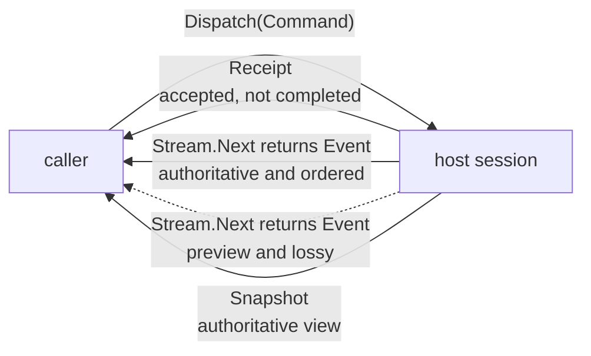
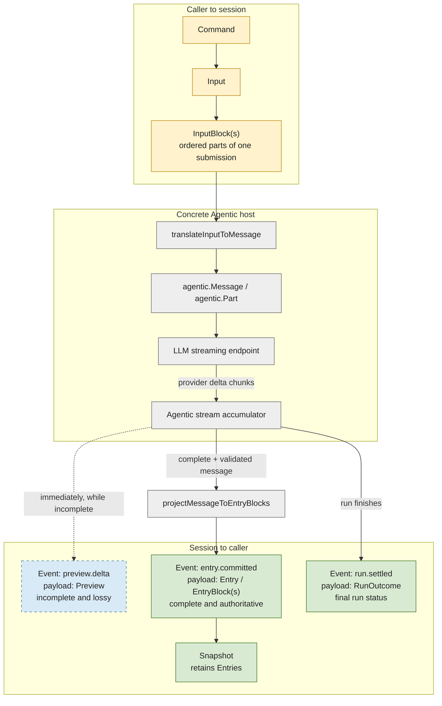
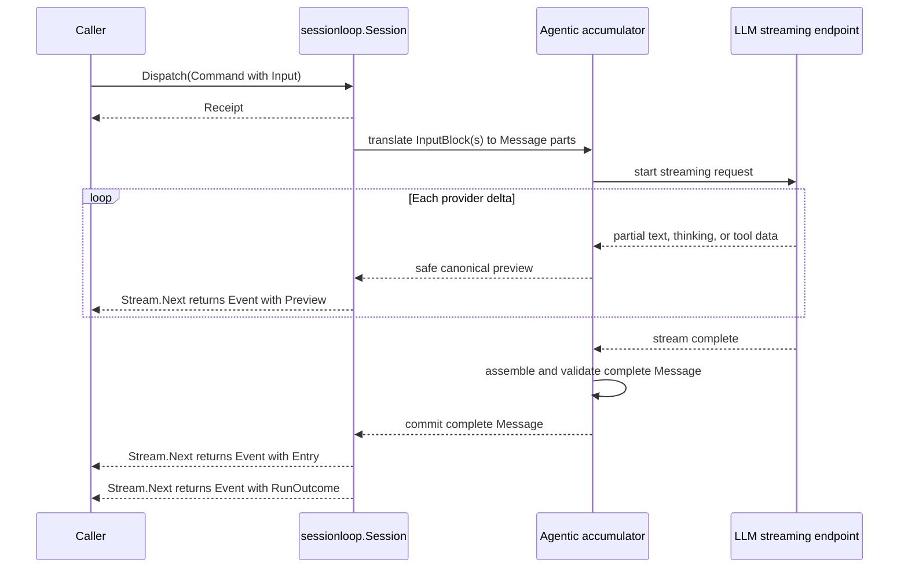

# sessionloop

`github.com/regularkevvv/agentic/harness/sessionloop` is the provider-neutral
asynchronous session protocol shared by Agentic Harness, the Agentic TUI
bridge, and external consumers. It is a standard-library-only module: its
`go.mod` has zero `require` directives, so importing it never places Agentic,
Harness, the TUI, a provider SDK, or a terminal library in your module graph.

The module defines the contract — types, validation, cloning, error
sentinels — plus a reusable conformance suite (`conformance`) and an
in-memory reference host (`testkit`). It does not execute a model. The full
design rationale lives in
[`docs/design/harness-sessionloop-plan.md`](../../docs/design/harness-sessionloop-plan.md).

## The command/event mental model

A session is a long-lived actor. Callers never block on an answer; they
dispatch commands, receive acceptance receipts, and observe truth as ordered
events reconciled by snapshots.



- **Dispatch → receipt.** `Dispatch` returns once the command is accepted
  under the receipt's declared guarantee (`accepted` or `durable`). The
  outcome arrives later through events and snapshots.
- **Two-tier stream.** Authoritative events are ordered facts with replay
  positions. Previews are lossy progress that never becomes transcript truth;
  losing them is observable (`Dropped`), losing authoritative events is
  terminal (`ErrLagged`).
- **Snapshot reconciliation.** On lag, gaps, or an unknown position, discard
  speculative state, load a `Snapshot`, and `Subscribe` after its position.
- **Settlement and reuse.** A run settles exactly once — completed,
  interrupted, or failed — and the session returns to idle for the next run.
  Suspension is a durable pause of the same run, not settlement.

## Exactly what moves through the system

`Stream.Next(ctx)` returns exactly one `Event`. That `Event` is the thing the
session "yields." It does not return an `Entry`, a model message, a provider
chunk, or a run output directly. The event's `Kind` says which typed payload is
present:

| Name | What it is | Complete? | Durable? |
|---|---|---:|---:|
| `Input` / `InputBlock` | One caller submission and its ordered parts, carried into the session by a `Command` | yes | only after the host accepts it under its declared guarantee |
| `agentic.Message` / `agentic.Part` | The Agentic implementation's private model-facing representation; not part of this module's API | depends on the implementation stage | no protocol promise |
| `Preview` | One incomplete, best-effort view of live generation, carried by an `EventPreviewDelta` event | no | no |
| `Entry` / `EntryBlock` | One complete conversation item committed by the session, carried by an `EventEntryCommitted` event and retained in `Snapshot` | yes | authoritative |
| `RunOutcome` | The singular completed/interrupted/failed settlement, carried by an `EventRunSettled` event | yes | authoritative |
| `Event` | The only value returned by `Stream.Next`; an envelope around one of the typed facts above | varies by kind | its `Nature` says |

The word "output" is intentionally not used for assistant text. Assistant text
is one or more `EntryBlock` values in an assistant `Entry`. `RunOutcome.Output`
means optional application-projected structured output; it is not the streamed
assistant response.

The separate block types are deliberate. `InputBlock` is caller-to-session
data and cannot contain tool-call or tool-result fields. `EntryBlock` is
session-to-consumer observation data and can describe completed text, data,
tool calls, and tool results. Their few repeated fields make an invalid
direction impossible to express instead of relying on comments around one
generic `Block` type.

An `Input` may contain many blocks. They are ordered parts of one logical
submission—not many turns. For example, text plus structured data is one
input; two separate user turns are two commands and eventually two entries.



### Provider streaming does not wait for a full entry

The protocol supports production LLM streaming without exposing any provider
SDK's chunk types. A concrete host consumes those chunks, accumulates them in
its model layer, and may publish safe canonical previews immediately. It waits
for a complete, validated message only before committing an authoritative
`Entry`. Therefore:

- a full block is **not** required to return a preview event;
- a complete message **is** required to return its committed-entry event; and
- settlement comes after every committed entry belonging to the run.

In Agentic Harness, this concrete path is selected with
`RuntimeConfig.ModelStreaming = true` when the configured model implements
`agentic.StreamModel`. Its `RequestStream` chunks become preview events through
the canonical Agentic event sink; the accumulated message then becomes the
committed entry. A non-streaming model still produces the same entry and
settlement events, simply without provider-delta previews.



Preview delivery is optional and lossy; entry and settlement delivery are the
authoritative contract. A consumer that disconnects mid-stream can recover
entries from `Snapshot`, but cannot reconstruct missed preview fragments.

### Protocol laws

| Law | Summary |
|---|---|
| L1 | One active run per session; starting while busy fails explicitly |
| L2 | Acceptance is not completion; receipts are not results |
| L3 | Every acknowledgement declares its guarantee: accepted or durable |
| L4 | The dispatch context governs acceptance only; runs belong to the session |
| L5 | Authoritative data is never inferred from previews |
| L6 | Replay positions are opaque; a zero position is not replayable |
| L7 | Snapshots are copy-owned authoritative truth and reconcile stream gaps |
| L8 | Targeted commands carry a RunID and cannot cross runs (`ErrStaleRun`) |
| L9 | Capabilities are honest; unsupported operations fail with `ErrUnsupported` |
| L10 | Settlement is singular and follows every entry of its run |
| L11 | Closing releases the handle, never the durable session |
| L12 | Content authority and privacy remain application-owned |

### Zero-position events are live-only

Replay positions are opaque and a zero position is not replayable (law L6).
Hosts use that seam deliberately: an authoritative event carrying a ZERO
position is a live-only signal for a state change that produced no durable
record, and it reaches only currently attached subscribers — it never appears
in snapshots or replays. The canonical example is a `session.state` event
announcing that a resolve bounced straight back to `suspended` because resume
validation failed before any run event; without the signal a consumer waiting
on the resolve would hang forever. Consumers reconcile zero-position events
against the next `Snapshot`, never against the durable log.

## Capabilities

Baseline behavior — new/open, start, snapshots, authoritative entries,
settlement, close — is required of every host and is not a capability.
Optional behavior is advertised explicitly and never emulated:

| Capability | Meaning |
|---|---|
| `acceptance.durable` | Receipts are crash-durable before they return |
| `events.replay` | Authoritative events replay strictly after a position |
| `events.preview` | Lossy preview deltas are published |
| `input.steer` | Steer the active run at its next steerable boundary |
| `input.follow_up` | Continue the active run after its current candidate |
| `input.next_turn` | Queue input for a future start; survives interruption |
| `run.interrupt` | Interrupt the active run |
| `run.suspension.resolve` | Durable suspensions resolved by exact ID |
| `dispatch.idempotent` | Idempotency keys deduplicate dispatches durably |
| `content.tools.detailed` | Tool call/result blocks carry structured detail |
| `output.structured` | Completed outcomes carry projected JSON output |

Unknown capability strings survive round trips, so vendors can extend the set
without breaking consumers.

## Three ways to drive a session

The protocol is one of three distinct consumption modes; naming them avoids
confusing their contracts:

- **Session facade mode (this module).** A consumer owns the top-level
  conversation through `sessionloop.Host`/`Session`: it dispatches commands,
  observes ordered events, and reconciles with snapshots. Downstream systems
  compose this protocol with their own principal binding; the protocol itself
  carries no memory or instruction concepts.
- **Principal attachment mode.** A separate, downstream-owned contract where
  an external principal attaches to an existing conversation it does not own.
  This module does not define or replace it; a facade-mode consumer must
  prevent double recording between the two modes.
- **The legacy blocking API.** Agentic Harness's original
  `Prompt`/`Resume`/`Interrupt` surface: synchronous calls that return the
  settled execution. It remains fully supported and unchanged; the Agentic
  sessionloop host is a view over the same durable sessions, so legacy calls
  and protocol commands see one shared truth.

## A runnable fake-host example

The `testkit` host is a complete in-memory implementation advertising every
capability except `dispatch.idempotent` (opt in with
`testkit.WithIdempotentDispatch()`, which backs the capability with a key map
recorded on the durable session state):

```go
package main

import (
	"context"
	"fmt"

	"github.com/regularkevvv/agentic/harness/sessionloop"
	"github.com/regularkevvv/agentic/harness/sessionloop/testkit"
)

func main() {
	ctx := context.Background()
	host := testkit.New() // default run: echo one assistant entry

	session, _ := host.NewSession(ctx, sessionloop.SessionOptions{})
	defer session.Close(ctx)

	stream, _ := session.Subscribe(ctx, sessionloop.SubscribeOptions{})
	defer stream.Close()

	receipt, _ := session.Dispatch(ctx, sessionloop.Command{
		Kind: sessionloop.CommandStart,
		Input: &sessionloop.Input{Blocks: []sessionloop.InputBlock{
			{Kind: sessionloop.InputBlockText, Text: "hello"},
		}},
	})
	fmt.Println("accepted run", receipt.RunID, "at", receipt.Position.Sequence)

	for {
		event, err := stream.Next(ctx)
		if err != nil {
			break
		}
		if event.Kind == sessionloop.EventEntryCommitted {
			fmt.Println(event.Entry.Role, event.Entry.Blocks[0].Text)
		}
		if event.Kind == sessionloop.EventRunSettled && event.RunID == receipt.RunID {
			fmt.Println("settled:", event.Outcome.Kind)
			break
		}
	}
}
```

## Conformance

Host adapters prove their claims with the reusable suite:

```go
func TestMyHostConformance(t *testing.T) {
	conformance.Run(t, func(t *testing.T) conformance.Env {
		host := newMyHost(t)
		return conformance.Env{Host: host, Gate: host} // Gate is optional
	})
}
```

Baseline cases always run; optional cases activate only for advertised
capabilities; timing-dependent cases skip without a `Gate`. See the
`conformance` package documentation for the full factory contract, including
the scripted scenario metadata.

## Development

`make check` runs formatting, vet, lint, race tests, and the independent 97%
coverage gate. The `conformance` and `testkit` packages are excluded from the
coverage measurement but are exercised by the main package's tests, which run
the conformance suite against the testkit host. An architecture test keeps
the module's `go.mod` free of `require`/`replace` directives and every import
inside the standard library.
