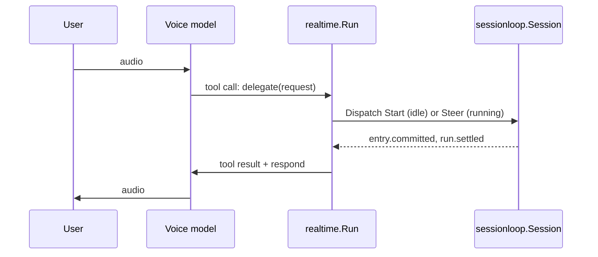

# realtime

`github.com/regularkevvv/agentic/realtime` is a provider-neutral voice
frontend for a [sessionloop](../harness/sessionloop/README.md) session. Its
only dependency is the zero-dependency `harness/sessionloop` module: no
Agentic, Harness, provider SDK, or WebRTC stack enters your module graph.

## Topology: the voice model delegates

A speech-to-speech model (OpenAI Realtime, xAI Grok Voice, …) holds the call.
It listens, detects turns, speaks, and handles barge-in. It is given exactly
one function, `delegate`. Anything beyond small talk becomes a sessionloop
command, and the committed answer becomes the function's output, which the
voice model then speaks.



The session remains the single owner of execution, tools, approvals, and the
durable transcript. The voice model's context is a disposable cache: each call
is seeded from the session's committed user and assistant text. Ending a call
never interrupts a delegated run (law L4); its result is replayed into the
next call.

## Interfaces

| Type | Role |
|---|---|
| `Conn` | The server's control channel to one live call: neutral `Event`s in, `Action`s out. Audio never crosses it. |
| `Signaler` | Establishes a call from a client: takes the client's `Offer` (e.g. a browser's WebRTC SDP offer), returns the `Answer` and the call's `Conn`. |

Clients never connect to a provider. A browser that held a provider session
could rewrite the voice model's instructions and tools, inject turns, and
forge `delegate` results, and the providers differ widely in what they let a
client change. Instead the browser reaches only a gateway you run:

```text
browser ──WebRTC (audio tracks + control data channel)──▶ gateway ──WebSocket──▶ voice provider
   └── authenticated HTTPS POST of the SDP offer
```

The application authenticates the offer, chooses the caller's session, calls
`Signaler.Accept`, and runs `Run` on the returned `Conn`. Which provider
answers is a server-side detail the browser never learns. The gateway also
owns what the provider no longer can: pacing audio out to the browser, and on
barge-in dropping unplayed audio and telling the provider how much was heard.

The live example in [`e2e/examples/realtime`](../e2e/examples/realtime)
implements this gateway with pion, relaying G.711 μ-law without transcoding to
OpenAI Realtime or xAI Grok Voice, in front of a real Harness session. It runs
headless, in a real browser page under headless Chrome, or for a person to
talk to.

## Not yet covered

- Resolving a suspended run by voice. A delegated run that pauses for approval
  is reported to the voice model, but no tool resolves it.
- Speaking previews before the run commits. Answers are spoken only after the
  assistant entry is committed.
- Reconciling a lagged session stream. `Run` returns instead.
- A neutral media plane. The example gateway moves audio itself; Conn and
  Signaler do not yet describe audio formats, interruption with the heard
  duration, usage, or provider capabilities.
- Opus on the client leg. The example negotiates telephone-band G.711, which
  both providers accept without transcoding.
- TURN and multi-node routing of the offer to the node that will own the call.

## Development

`just check` runs formatting, vet, lint, race tests, and the 97% coverage gate
with `GOWORK=off`, against the published `harness/sessionloop` release.
