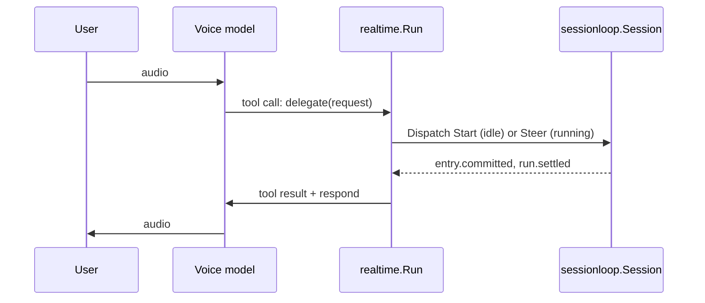

# realtime

`github.com/regularkevvv/agentic/realtime` is a provider-neutral voice
frontend for a [sessionloop](../harness/sessionloop/README.md) session. Its
only dependency is the zero-dependency `harness/sessionloop` module: no
Agentic, Harness, provider SDK, or WebRTC stack enters your module graph.

## Topology: the voice model delegates

A speech-to-speech model (OpenAI Realtime, xAI Grok Voice, …) holds the call.
It listens, detects turns, speaks, and handles barge-in. It is given exactly
one function, `delegate`. Anything beyond small talk becomes a sessionloop
command, and the committed answer becomes the function's output, which the
voice model then speaks.

The session remains the single owner of execution, tools, approvals, and the
durable transcript. The voice model's context is a disposable cache: each call
is seeded from the session's committed user and assistant text. Ending a call
never interrupts a delegated run (law L4); its result is replayed into the
next call.

## Interfaces

| Type | Role |
|---|---|
| `Conn` | The server's control channel to one live call: neutral `Event`s in, `Action`s out. Audio never crosses it. |
| `Signaler` | Establishes a call whose media flows directly between client and provider: takes the client's `Offer` (e.g. a WebRTC SDP offer), returns the `Answer` and a `Conn` attached to the same call. |

`Signaler` is optional because not every provider can attach a server to a
client-originated call. OpenAI Realtime can (WebRTC plus a sideband
WebSocket); xAI has no WebRTC, so a browser call must be relayed through the
server, and the relay implements `Conn` directly. SIP calls fit either shape.

Concrete adapters live with the assembling application. The live example in
[`e2e/examples/realtime`](../e2e/examples/realtime) implements OpenAI over
WebSocket and WebRTC with a sideband, and xAI over WebSocket, against a real
Harness.

## Not yet covered

- Resolving a suspended run by voice. A delegated run that pauses for approval
  is reported to the voice model, but no tool resolves it.
- Speaking previews before the run commits. Answers are spoken only after the
  assistant entry is committed.
- Reconciling a lagged session stream. `Run` returns instead.

## Development

`just check` runs formatting, vet, lint, race tests, and the 97% coverage gate
with `GOWORK=off`, against the published `harness/sessionloop` release.
